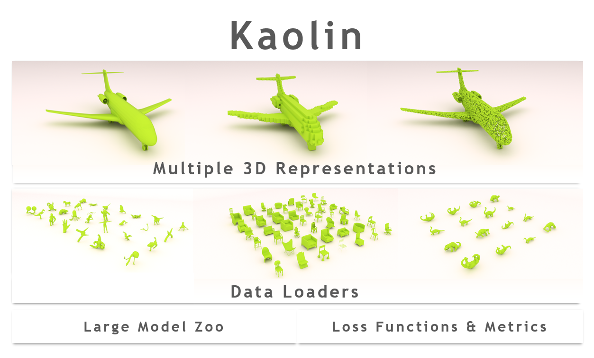

# Kaolin: A PyTorch Library for Accelerating 3D Deep Learning Research

> **NOTE:** **Kaolin will be released on the morning of 13 November 2019 (Eastern Standard Time).**

Kaolin is a PyTorch library aiming to accelerate 3D deep learning research. Kaolin provides efficient implementations of differentiable 3D modules for use in deep learning systems. With functionality to load and preprocess several popular 3D datasets, and native functions to manipulate meshes, pointclouds, signed distance functions, and voxel grids, Kaolin mitigates the need to write wasteful boilerplate code. Kaolin packages together several differentiable graphics modules including rendering, lighting, shading, and view warping. Kaolin also supports an array of loss functions and evaluation metrics for seamless evaluation and provides visualization functionality to render the 3D results. Importantly, we curate a comprehensive model zoo comprising many state-of-the-art 3D deep learning architectures, to serve as a starting point for future research endeavours.

    

