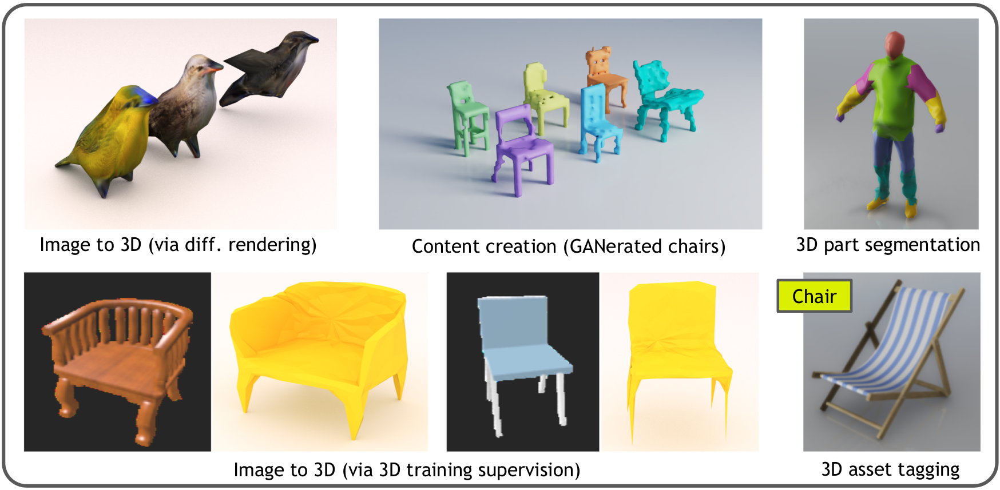

[](https://www.repostatus.org/#wip)
[](https://github.com/NVIDIAGameWorks/kaolin/blob/master/LICENSE)

## /!\ Reformat /!\

A reformat is currently planned on Kaolin, we are expecting the reformat branch to be released in late August.
Pull request reviews will be delayed until then.

<p align="center">
    
</p>

## Kaolin: A PyTorch Library for Accelerating 3D Deep Learning Research

**[Documentation](https://kaolin.readthedocs.io/en/latest/)** | **[Paper](https://arxiv.org/abs/1911.05063)**

__Kaolin is an active work-in-progress, we are working toward a stable beta release. Please Watch our github repository for releases to be notified. To start trying our code today see instructions below.__

Kaolin is a PyTorch library aiming to accelerate 3D deep learning research. Kaolin provides efficient implementations of differentiable 3D modules for use in deep learning systems. With functionality to load and preprocess several popular 3D datasets, and native functions to manipulate meshes, pointclouds, signed distance functions, and voxel grids, Kaolin mitigates the need to write wasteful boilerplate code. Kaolin packages together several differentiable graphics modules including rendering, lighting, shading, and view warping. Kaolin also supports an array of loss functions and evaluation metrics for seamless evaluation and provides visualization functionality to render the 3D results. Importantly, we curate a comprehensive model zoo comprising many state-of-the-art 3D deep learning architectures, to serve as a starting point for future research endeavours.


> *Fun fact*: The name _Kaolin_, it’s from Kaolinite, a form of plasticine (clay) that is sometimes used in 3D modeling.


## Table of Contents
- [Functionality](#functionality)
- [Installation And Usage](#installation-and-usage)
  - [Supported Platforms](#supported-platforms)
  - [Install Kaolin](#install-kaolin)
  - [Verify Installation](#verify-installation)
  - [Building the Documentation](#building-the-documentation)
  - [Running Unittests](#running-unittests)
- [Main Modules](#main-modules)
- [Getting Started](#getting-started)
- [Acknowledgements](#acknowledgements)
- [License](#license)

## Functionality

<p align="center">
    
</p>

Currently, the (beta) release contains several processing functions for 3D deep learning on meshes, voxels, signed distance functions, and pointclouds. Loading of several popular datasets (eg. ShapeNet, ModelNet, SHREC) are supported out-of-the-box. We also implement several 3D conversion and transformation operations (both within and across the aforementioned representations). 

Kaolin supports several 3D tasks such as:
* Differentiable rendering (see [Neural Mesh Renderer](https://github.com/hiroharu-kato/neural_renderer), its [PyTorch port](https://github.com/daniilidis-group/neural_renderer), [Soft Rasterizer](https://github.com/ShichenLiu/SoftRas), [Differentiable Interpolation-based Renderer](https://nv-tlabs.github.io/DIB-R/), and a modular and extensible abstract DifferentiableRenderer specification).
* Single-image based mesh reconstruction ([Pixel2Mesh](https://github.com/nywang16/Pixel2Mesh), [GEOMetrics](https://github.com/EdwardSmith1884/GEOMetrics), [OccupancyNets](https://github.com/autonomousvision/occupancy_networks), and more...)
* Pointcloud classification and segmentation ([PointNet](https://github.com/fxia22/pointnet.pytorch), [PoinNet++](https://github.com/erikwijmans/Pointnet2_PyTorch), [DGCNN](https://github.com/muhanzhang/pytorch_DGCNN), ...)
* Mesh classification and segmentation ([MeshCNN](https://github.com/ranahanocka/MeshCNN), [GCN](https://github.com/tkipf/pygcn))
* 3D superresolution on voxel grids ([ODM](https://github.com/EdwardSmith1884/Multi-View-Silhouette-and-Depth-Decomposition-for-High-Resolution-3D-Object-Representation), VoxelUNet, and more...)
* Basic graphics utilities (lighting, shading, etc.)

## Model Zoo

Kaolin curates a large _model zoo_ containing reference implementations of popular 3D DL architectures. Head over [here](kaolin/models) to check them out.

> *NOTE*: For several of these models, the implementation is due to the original authors. We build a bridge to our library and wherever possible, we introduce optimization. If you use any of the models in the model zoo, or the graphics packages (eg. differentiable renderers such as [NMR](https://arxiv.org/abs/1711.07566), [SoftRas](https://arxiv.org/abs/1904.01786), [DIB-R](https://arxiv.org/abs/1908.01210)), please cite the original papers in addition to Kaolin. For convenience, BibTeX citation formats for each of the original papers are included in the documentation for each model provided.


## Installation and Usage

> **NOTE**: The API is currently somewhat unstable, as we're making constant changes. (It's a beta release)

See supplemental section `Windows Build` for instructions specific to that platform.

### Requirements
- Linux
- Python == 3.6
- CUDA >= 10.0.130 (with `nvcc` installed)
- Display Driver >= 410.48

### Dependencies
- numpy >= 1.17, <1.18.4
- PyTorch >=1.2, <1.5 and Torchvision >=0.4.0, <0.6.0 (see [pytorch.org](http://pytorch.org) for installation instructions)

### Installation

We highly recommend installing Kaolin inside of a virtual environment (such as ones created using `conda` or `virtualenv`). In this example, we show how to create a `conda` virtual environment for installing kaolin.
```sh
$ conda create --name kaolin python=3.6
$ conda activate kaolin
```

#### Dependencies
Install PyTorch and Torchvision by following instructions from https://pytorch.org/. Numpy will be installed as part of the Pytorch installation. Note that the setup file does not automatically install these dependencies.

#### Install Kaolin
Now, you can install the library. From the root directory of this repo (i.e., the directory containing this `README` file), run

##### For General Use
```sh
$ python setup.py build_ext --inplace   # optional, allows importing kaolin from the kaolin root directory
$ python setup.py install
```

##### For Development (modifying kaolin code)
```sh
$ python setup.py develop
```
Note, if modifying or adding Cython files, ensure that Cython is installed and set the following environment variable `USE_CYTHON=1`.

During installation, the *packman* package manager will 
download the nv-usd package to `~/packman-repo/` containing the necessary packages for reading and writing Universal Scene Description (USD) files. 

Note, if you are using an heterogeneous GPUs setup set the architectures for which you want to compile the cuda code using the environment variable.

Example:
```sh
$ export TORCH_CUDA_ARCH_LIST="7.0 7.5"
```

### Verify installation

To verify that `kaolin` has been installed, fire up your python interpreter, and execute the following commands.

```python
>>> import kaolin as kal
>>> print(kal.__version__)
```

### Windows Build

Windows support is currently considered experimental.

> **NOTE**: USD support is currently unimplemented on this platform.

#### Prerequisites

* Visual Studio 2019 (2017 untested)
* Anaconda 3

#### Building

Perform from within a `Anaconda Prompt (Anaconda3)`:
* `conda create --name kaolin python=3.6`
* `conda activate kaolin`
* `conda install pytorch torchvision cudatoolkit=10.2 -c pytorch`
* Execute the `vcvars64.bat` batch file corresponding to the installed version of Visual Studio (Example: `%comspec% /k "C:\Program Files (x86)\Microsoft Visual Studio\2019\Professional\VC\Auxiliary\Build\vcvars64.bat"`)
* `python setup.py build_ext --inplace`
* `python setup.py install`
* `pip install --no-dependencies nuscenes-devkit opencv-python-headless scikit-learn joblib pyquaternion cachetools`

#### Verifying Build

From within the previously created kaolin conda environment:
* `python -c "import kaolin; print(kaolin.__version__)"`
* `pytest tests/`


### Building the Documentation

To delve deeper into the library, build the documentation. From the root directory of the repository (i.e., the directory containing this `README` file), execute the following.

```bash
$ cd docs
$ sphinx-build . _build
```

### Running Unittests

To run unittests, from the root directory of the repository (i.e., the directory containing this `README` file), execute the following commands.

```bash
$ . setenv.sh
$ pytest tests/
```

## Main Modules

- **rep**: Supported 3D asset representations include: Triangle Meshes, Quad Meshes, Voxel Grids, Point Clouds, Signed Distance Functions (SDF).

- **conversions**: Supports conversion across all popular 3D representations.

- **models**: Provided models include the following. For each implementation, we also provide a link to the *original implementation which it was ported from* 
    - DGCNN [[Paper](https://arxiv.org/abs/1801.07829v1)], [[Original implementation](https://github.com/WangYueFt/dgcnn)]
    - DIB-R [[Paper](https://arxiv.org/abs/1908.01210)], [[Original implementation](https://github.com/nv-tlabs/DIB-R/)]
    - GEOMetrics [[Paper](https://arxiv.org/abs/1901.11461)], [[Original implementation](https://github.com/EdwardSmith1884/GEOMetrics)]
    - Image2Mesh [[Paper](https://arxiv.org/abs/1711.10669)], [[Original implementation](https://github.com/jhonykaesemodel/image2mesh)]
    - Occupancy Network [[Paper](https://arxiv.org/abs/1812.03828)], [[Original implementation](https://github.com/autonomousvision/occupancy_networks)]
    - Pixel2Mesh [[Paper](https://arxiv.org/abs/1804.01654)], [[Original implementation (TensorFlow)](https://github.com/nywang16/Pixel2Mesh)], [[Re-implementation that we borrow from](https://github.com/EdwardSmith1884/GEOMetrics)]
    - PointNet [[Paper](https://arxiv.org/abs/1612.00593)], [[Original implementation](https://github.com/charlesq34/pointnet)], [[Re-implementation (we borrow from here)](https://github.com/fxia22/pointnet.pytorch/)]
    - PointNet++ [[Paper](https://arxiv.org/abs/1706.02413)], [[Original implementation (we borrow  from here)](https://github.com/charlesq34/pointnet2)], [[Re-implementation (we borrow from here)](https://github.com/erikwijmans/Pointnet2_PyTorch)]
    - MeshEncoder: A simple mesh encoder architecture.
    - GraphResNet: MeshEncoder with residual connections.
    - OccupancyNetworks [[Paper](https://arxiv.org/abs/1812.03828)], [[Original implementation](https://github.com/autonomousvision/occupancy_networks)]
    - MeshCNN: [[Paper](https://arxiv.org/abs/1809.05910)], [[Original implementation](https://github.com/ranahanocka/MeshCNN)]
    - VoxelGAN [[Paper](http://3dgan.csail.mit.edu/papers/3dgan_nips.pdf)], [[Original implementation](https://github.com/zck119/3dgan-release)]
    - AtlasNet [[Paper](https://arxiv.org/abs/1802.05384)], [[Original implementation](https://github.com/ThibaultGROUEIX/AtlasNet)]
    - And many more to come!

> *NOTE*: For several of these models, the implementation is due to the original authors. We build a bridge to our library and wherever possible, we introduce optimization. If you use any of the models in the model zoo, or the graphics packages (eg. differentiable renderers such as [NMR](https://arxiv.org/abs/1711.07566), [SoftRas](https://arxiv.org/abs/1904.01786), [DIB-R](https://arxiv.org/abs/1908.01210)), please cite the original papers in addition to Kaolin. For convenience, BibTeX citation formats for each of the original papers are included in the documentation for each model provided.

- **graphics**: Kaolin provides a flexible and modular framework for building differentiable renderers, making it simple to replace individual components with new ones. Kaolin also provides implementations of the following differentiable renderers:
    - DIB-R [[Paper](https://arxiv.org/abs/1908.01210)], [[Original implementation (we borrow from here)](https://github.com/nv-tlabs/DIB-R/)]
    - SoftRas [[Paper](https://arxiv.org/abs/1904.01786)], [[Original implementation (we borrow from here)](https://github.com/ShichenLiu/SoftRas)]
    - Neural 3D Mesh Renderer [[Paper](https://arxiv.org/abs/1711.07566)], [[Original Chainer implementation](https://github.com/hiroharu-kato/neural_renderer)], [[PyTorch re-implementation (we borrow from here)](https://github.com/daniilidis-group/neural_renderer)]

- **metrics**: Implemented metrics and loss functions:
    - Mesh: Triangle Distance, Chamfer Distance, Edge Length regularization, Laplacian regularization, Point to Surface distance, Normal consistency
    - Point Cloud: Sided Distance, Chamfer Distance, Directed Distance
    - Voxel Grid: Intersection Over Union (3D IoU), F-Score

### 

## Getting Started

Take a look at some of our examples!! Examples include differentiable renderers, voxel superresolution, etc. Begin [here](examples).

> **Note:** We will (very soon) host our docs online. Stay tuned for the link. Until then, please follow instructions from [above](#building-the-documentation) to build docs.


## Contributors
[Krishna Murthy Jatavallabhula](https://krrish94.github.io/),
[Edward Smith](https://github.com/EdwardSmith1884),
[Jean-Francois Lafleche](https://www.linkedin.com/in/jflafleche),
[Clement Fuji Tsang](https://ca.linkedin.com/in/clement-fuji-tsang-b8028a82),
[Artem Rozantsev](https://sites.google.com/site/artemrozantsev/),
[Wenzheng Chen](http://www.cs.toronto.edu/~wenzheng/),
[Tommy Xiang](https://github.com/TommyX12),
[Rev Lebaredian](https://blogs.nvidia.com/blog/author/revlebaredian/),
[Gavriel State](https://ca.linkedin.com/in/gavstate),
[Sanja Fidler](https://www.cs.utoronto.ca/~fidler/),

## Acknowledgements
**[Acknowledgements](Acknowledgements.txt)**

We would like to thank [Amlan Kar](https://amlankar.github.io) for suggesting the need for this library. We also thank [Ankur Handa](http://ankurhanda.github.io) for his advice during the initial and final stages of the project. Many thanks to [Joanh Philion](https://scholar.google.com/citations?user=VVIAoY0AAAAJ&hl=en), [Daiqing Li](https://www.linkedin.com/in/daiqing-li-23873789?originalSubdomain=ca), [Mark Brophy](https://ca.linkedin.com/in/mark-brophy-3a298382), [Jun Gao](http://www.cs.toronto.edu/~jungao/), and [Huan Ling](http://www.cs.toronto.edu/~linghuan/) who performed detailed internal reviews, and provided constructive comments. We also thank [Gavriel State](https://ca.linkedin.com/in/gavstate) for all his help during the project.

Most importantly, we thank all 3D DL researchers who have made their code available as open-source. The field could use a lot more of it!


## License and Copyright
**[LICENSE](LICENSE)** | **[COPYRIGHT](COPYRIGHT)**

If you find this library useful, consider citing the following paper:
```
@article{kaolin2019arxiv,
    author = {J., {Krishna Murthy} and Smith, Edward and Lafleche, Jean-Francois and {Fuji Tsang}, Clement and Rozantsev, Artem and Chen, Wenzheng and Xiang, Tommy and Lebaredian, Rev and Fidler, Sanja},
    title = {Kaolin: A PyTorch Library for Accelerating 3D Deep Learning Research},
    journal = {arXiv:1911.05063},
    year = {2019},
}
```

## Contributors for borrowed sources

Here is a list of all authors on relevant research papers that Kaolin borrows code from. Without the efforts of these folks (and their willingness to release their implementations under permissive open-source licenses), Kaolin would not have been possible.

* Kornia: Edgar Riba, Dmytro Mishkin, Daniel Ponsa, Ethan Rublee and Gary Bradski. [[Paper](https://arxiv.org/pdf/1910.02190.pdf)] [[Code](https://github.com/kornia/kornia)]
* Occupancy Networks: Lars Mescheder, Michael Oechsle, Michael Niemeyer, Sebastian Nowozin, Andreas Geiger. [[Paper](https://avg.is.tuebingen.mpg.de/publications/occupancy-networks)] [[Code](https://github.com/autonomousvision/occupancy_networks)]
* Multi-View Silhouette and Depth Decomposition for High Resolution 3D Object Representation: Edward Smith, Scott Fujimoto, David Meger. [[Paper](https://papers.nips.cc/paper/7883-multi-view-silhouette-and-depth-decomposition-for-high-resolution-3d-object-representation.pdf)] [[Code](https://github.com/EdwardSmith1884/Multi-View-Silhouette-and-Depth-Decomposition-for-High-Resolution-3D-Object-Representation)]
* Pytorch Chamfer Distance: Christian Diller. [[Code](https://github.com/chrdiller/pyTorchChamferDistance)]
* GEOMetrics: Edward Smith, Scott Fujimoto, Adriana Romero, David Meger. [[Paper](https://arxiv.org/abs/1901.11461)] [[Code](https://github.com/EdwardSmith1884/GEOMetrics)]
* DeepSDF: Jeong Joon Park, Peter Florence, Julian Straub, Richard Newcombe, Steven Lovegrove. [[Paper](http://openaccess.thecvf.com/content_CVPR_2019/html/Park_DeepSDF_Learning_Continuous_Signed_Distance_Functions_for_Shape_Representation_CVPR_2019_paper.html)] [[Code](https://github.com/facebookresearch/DeepSDF)]
* PointGAN: Fei Xia. [[Code](https://github.com/fxia22/pointGAN)]
* AtlasNet: Thibault Groueix, Matthew Fisher, Vladimir G. Kim, Bryan C. Russell, Mathieu Aubry. [[Paper](https://arxiv.org/abs/1802.05384)] [[Code](https://github.com/ThibaultGROUEIX/AtlasNet)]
* PointNet: Charles R. Qi, Hao Su, Kaichun Mo, Leonidas J. Guibas. Also, Fei Xia (reimplementation). [[Paper](https://arxiv.org/abs/1612.00593)] [[Code](https://github.com/fxia22/pointnet.pytorch)]
* MeshCNN: Rana Hanocka, Amir Hertz, Noa Fish, Raja Giryes, Shachar Fleishman, Daniel Cohen-Or. [[Paper](https://arxiv.org/abs/1809.05910)] [[Code](https://github.com/ranahanocka/MeshCNN)]
* DGCNN: Muhan Zhang, Zhicheng Cui, Marion Neumann, Yixin Chen. [[Paper](https://www.cse.wustl.edu/~muhan/papers/AAAI_2018_DGCNN.pdf)] [[Code](https://github.com/muhanzhang/pytorch_DGCNN)]
* Neural 3D Mesh Renderer: Hiroharu Kato, Yoshitaka Ushiku, Tatsuya Harada. Also, Nikos Kolotouros (for reimplementation). [[Paper](https://arxiv.org/abs/1711.07566)] [[Code](https://github.com/daniilidis-group/neural_renderer)]
* SoftRasterizer: Shichen Liu, Tianye Li, Weikai Chen, Hao Li. [[Paper](https://arxiv.org/abs/1904.01786)] [[Code](https://github.com/ShichenLiu/SoftRas)]
* DIB-R: Wenzheng Chen, Jun Gao, Huan Ling, Edward J. Smith, Jaakko Lehtinen, Alec Jacobson, Sanja Fidler. [[Paper](https://arxiv.org/abs/1908.01210)] [[Code](https://github.com/nv-tlabs/DIB-R)]
* PointNet++: Charles R. Qi, Li (Eric) Yi, Hao Su, Leonidas J. Guibas. Also, Erik Wijmans (reimplementation). [[Paper](https://arxiv.org/abs/1706.02413)] [[Code](https://github.com/erikwijmans/Pointnet2_PyTorch)]
* Learning a Probabilistic Latent Space of Object Shapes via 3D Generative-Adversarial Modeling': Jiajun Wu, Chengkai Zhang, Tianfan Xue, William T. Freeman, Joshua B. Tenenbaum. [[Paper](http://arxiv.org/abs/1610.07584)] [[Code](https://github.com/zck119/3dgan-release)]
