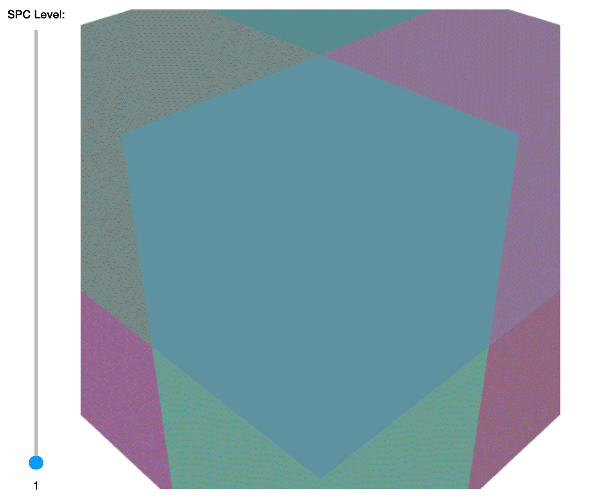

# Kaolin: A Pytorch Library for Accelerating 3D Deep Learning Research

<p align="center">
    
</p>

## Overview
NVIDIA Kaolin library provides a PyTorch API for working with a variety of 3D representations and includes a growing collection of GPU-optimized operations such as modular differentiable rendering, fast conversions between representations, data loading, 3D checkpoints and more. 

Kaolin library is part of a larger suite of tools for 3D deep learning research. For example, the [Omniverse Kaolin App](https://docs.omniverse.nvidia.com/app_kaolin/app_kaolin/overview.html) allows interactive visualization of 3D checkpoints. To find out more about the Kaolin ecosystem, visit the [NVIDIA Kaolin Dev Zone page](https://developer.nvidia.com/kaolin).

## Installation and Getting Started

Visit the [Kaolin Library Documentation](https://kaolin.readthedocs.io/en/latest/) to get started!

## About the Latest Release (0.10.0)

With the version 0.10.0 we are focusing on Volumetric rendering, adding new features for tetrahedral meshes, including DefTet volumetric renderer and losses, and Deep Marching Tetrahedrons, and adding new primitive operations for efficient volumetric rendering of Structured Point Clouds, we are also adding support for materials with USD importation.

Finally we are adding two new tutorials to show how to use the latest features from Kaolin:
* [How to use DMtet](examples/tutorial/dmtet_tutorial.ipynb) to rencontruct a mesh from point clouds generated by the Omniverse Kaolin App

<p float="left">
  <a href="examples/tutorial/dmtet_tutorial.ipynb">
    
  </a>
</p>

* An [Introduction to Structured Point Clouds](examples/tutorial/understanding_spcs_tutorial.ipynb), with conversion from mesh and interactive visualization with raytracing.

<p float="left">
  <a href="examples/tutorial/understanding_spcs_tutorial.ipynb">
    
  </a>
</p>

See [change logs](https://github.com/NVIDIAGameWorks/kaolin/releases/tag/v0.10.0) for details.

## Contributing

Please review our [contribution guidelines](CONTRIBUTING.md).

## External Projects using Kaolin

* [gradSim: Differentiable simulation for system identification and visuomotor control](https://github.com/gradsim/gradsim):
   * Use [DIB-R rasterizer](https://kaolin.readthedocs.io/en/latest/modules/kaolin.render.mesh.html#kaolin.render.mesh.dibr_rasterization), [obj loader](https://kaolin.readthedocs.io/en/latest/modules/kaolin.io.obj.html#kaolin.io.obj.import_mesh) and [timelapse](https://kaolin.readthedocs.io/en/latest/modules/kaolin.visualize.html#kaolin.visualize.Timelapse)
* [Learning to Predict 3D Objects with an Interpolation-based Differentiable Renderer](https://github.com/nv-tlabs/DIB-R-Single-Image-3D-Reconstruction/tree/2cfa689881145c8e0647ae8dd077e55b5a578658):
   * Use [Kaolin's DIB-R rasterizer](https://kaolin.readthedocs.io/en/latest/modules/kaolin.render.mesh.html#kaolin.render.mesh.dibr_rasterization), [camera functions](https://kaolin.readthedocs.io/en/latest/modules/kaolin.render.camera.html) and [Timelapse](https://kaolin.readthedocs.io/en/latest/modules/kaolin.visualize.html#kaolin.visualize.Timelapse) for 3D checkpoints.
* [Neural Geometric Level of Detail: Real-time Rendering with Implicit 3D Surfaces](https://github.com/nv-tlabs/nglod):
    * Use [SPC](https://kaolin.readthedocs.io/en/latest/modules/kaolin.ops.spc.html) conversions and [ray-tracing](https://kaolin.readthedocs.io/en/latest/modules/kaolin.render.spc.html#kaolin.render.spc.unbatched_raytrace), yielding 30x memory and 3x training time reduction.
* [Learning Deformable Tetrahedral Meshes for 3D Reconstruction](https://github.com/nv-tlabs/DefTet):
    * Use [Kaolin's DefTet volumetric renderer](https://kaolin.readthedocs.io/en/latest/modules/kaolin.render.mesh.html#kaolin.render.mesh.deftet_sparse_render), [tetrahedral losses](https://kaolin.readthedocs.io/en/latest/modules/kaolin.metrics.tetmesh.html), [camera_functions](https://kaolin.readthedocs.io/en/latest/modules/kaolin.render.camera.html), [mesh operators and conversions](https://kaolin.readthedocs.io/en/latest/modules/kaolin.ops.html), [ShapeNet dataset](https://kaolin.readthedocs.io/en/latest/modules/kaolin.io.shapenet.html#kaolin.io.shapenet.ShapeNetV1), [point_to_mesh_distance](https://kaolin.readthedocs.io/en/latest/modules/kaolin.metrics.trianglemesh.html#kaolin.metrics.trianglemesh.point_to_mesh_distance)and [sided_distance](https://kaolin.readthedocs.io/en/latest/modules/kaolin.metrics.pointcloud.html#kaolin.metrics.pointcloud.sided_distance).
* [Text2Mesh](https://github.com/threedle/text2mesh):
    * Use [Kaolin's rendering functions](https://kaolin.readthedocs.io/en/latest/modules/kaolin.render.mesh.html#), [camera functions](https://kaolin.readthedocs.io/en/latest/modules/kaolin.render.camera.html), and [obj](https://kaolin.readthedocs.io/en/latest/modules/kaolin.io.obj.html#kaolin.io.obj.import_mesh) and [off](https://kaolin.readthedocs.io/en/latest/modules/kaolin.io.off.html#kaolin.io.off.import_mesh) importers.

## Citation

If you are using Kaolin library for your research, please cite:

```
@misc{Kaolin2019,
author = {Clement Fuji Tsang and Masha Shugrina and Jean Francois Lafleche and Towaki Takikawa and Jiehan Wang and Charles Loop and Wenzheng Chen and Krishna Murthy Jatavallabhula and Edward Smith and Artem Rozantsev and Or Perel and Frank Shen and Jun Gao and Sanja Fidler and Gavriel State and Jason Gorski and Tommy Xiang and Jianing Li and Michael Li and Rev Lebaredian}
title = {Kaolin}
year = {2019}
}
```
## Contributors

Current Team:

- Technical Lead: Clement Fuji Tsang
- Manager: Masha Shugrina
- Jean-Francois Lafleche
- Charles Loop
- Or Perel
- Towaki Takikawa
- Jiehan Wang

Other Majors Contributors:

- Wenzheng Chen
- Sanja Fidler
- Jun Gao
- Jason Gorski
- Rev Lebaredian
- Jianing Li
- Michael Li
- Krishna Murthy Jatavallabhula
- Artem Rozantsev
- Tianchang (Frank) Shen
- Edward Smith
- Gavriel State
- Tommy Xiang
