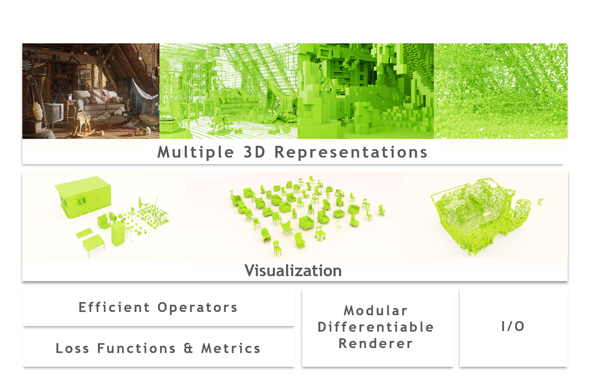
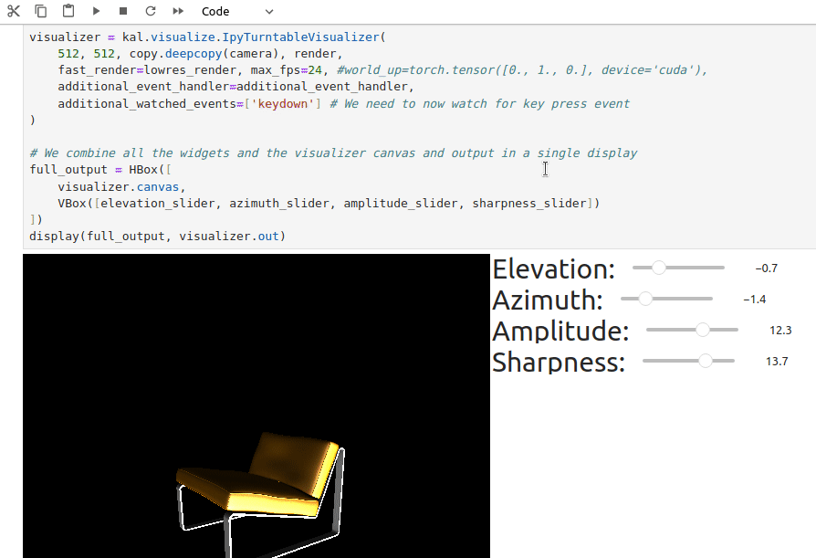
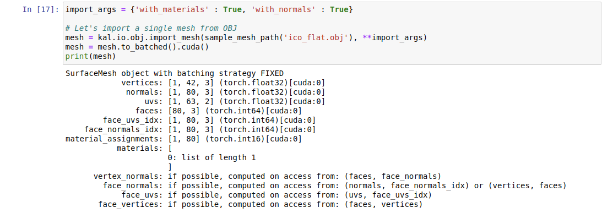

# Kaolin: A Pytorch Library for Accelerating 3D Deep Learning Research

<p align="center">
    
</p>

## Overview
NVIDIA Kaolin library provides a PyTorch API for working with a variety of 3D representations and includes a growing collection of GPU-optimized operations such as modular differentiable rendering, fast conversions between representations, data loading, 3D checkpoints, differentiable camera API, differentiable lighting with spherical harmonics and spherical gaussians, powerful quadtree acceleration structure called Structured Point Clouds, interactive 3D visualizer for jupyter notebooks, convenient batched mesh container and more. Visit the [Kaolin Library Documentation](https://kaolin.readthedocs.io/en/latest/) to get started!

Note that Kaolin library is part of the larger [NVIDIA Kaolin effort](https://developer.nvidia.com/kaolin) for 3D deep learning.

## Installation and Getting Started

Starting with v0.12.0, Kaolin supports installation with wheels:
```
# Replace TORCH_VERSION and CUDA_VERSION with your torch / cuda versions
pip install kaolin==0.12.0 -f https://nvidia-kaolin.s3.us-east-2.amazonaws.com/torch-{TORCH_VERSION}_cu{CUDA_VERSION}.html
```
For example, to install kaolin 0.13.0 over torch 1.12.1 and cuda 11.3:
```
pip install kaolin==0.13.0 -f https://nvidia-kaolin.s3.us-east-2.amazonaws.com/torch-1.12.1_cu113.html
```

We now support versions 0.12.0 to 0.14.0.

## About the Latest Release (0.14.0)

In this version we added a [conversion Op for mesh to SPC](https://kaolin.readthedocs.io/en/latest/modules/kaolin.ops.conversions.html#kaolin.ops.conversions.unbatched_mesh_to_spc),
which allows turning meshes into Structured Point Cloud, our octree based representation.
In addition, [interactive 3D visualizers](https://kaolin.readthedocs.io/en/latest/modules/kaolin.visualize.html) for Jupyter notebooks
and a [SurfaceMesh class](https://kaolin.readthedocs.io/en/latest/modules/kaolin.rep.surface_mesh.html#kaolin-rep-surfacemesh) (see tutorials below).


Check our new tutorials:

[**Bring any custom renderer** into a Jupyter notebook for debugging. Use Kaolin Camera to navigate:](https://github.com/NVIDIAGameWorks/kaolin/blob/master/examples/tutorial/interactive_visualizer.ipynb)

<a href="https://github.com/NVIDIAGameWorks/kaolin/blob/master/examples/tutorial/interactive_visualizer.ipynb"></a>

[Read and manage **batched mesh attributes** with convenience using SurfaceMesh:](https://github.com/NVIDIAGameWorks/kaolin/blob/master/examples/tutorial/working_with_meshes.ipynb)

<a href="https://github.com/NVIDIAGameWorks/kaolin/blob/master/examples/tutorial/working_with_meshes.ipynb"></a>

See [change logs](https://github.com/NVIDIAGameWorks/kaolin/releases/tag/v0.14.0) for details.

## Contributing

Please review our [contribution guidelines](CONTRIBUTING.md).

## External Projects using Kaolin

* [NVIDIA Kaolin Wisp](https://github.com/NVIDIAGameWorks/kaolin-wisp):
   * Use [Camera API](https://kaolin.readthedocs.io/en/latest/modules/kaolin.render.camera.html), [Structured Point Clouds](https://kaolin.readthedocs.io/en/latest/modules/kaolin.ops.spc.html) and its [rendering capabilities](https://kaolin.readthedocs.io/en/latest/modules/kaolin.render.spc.html)
* [gradSim: Differentiable simulation for system identification and visuomotor control](https://github.com/gradsim/gradsim):
   * Use [DIB-R rasterizer](https://kaolin.readthedocs.io/en/latest/modules/kaolin.render.mesh.html#kaolin.render.mesh.dibr_rasterization), [obj loader](https://kaolin.readthedocs.io/en/latest/modules/kaolin.io.obj.html#kaolin.io.obj.import_mesh) and [timelapse](https://kaolin.readthedocs.io/en/latest/modules/kaolin.visualize.html#kaolin.visualize.Timelapse)
* [Learning to Predict 3D Objects with an Interpolation-based Differentiable Renderer](https://github.com/nv-tlabs/DIB-R-Single-Image-3D-Reconstruction/tree/2cfa689881145c8e0647ae8dd077e55b5a578658):
   * Use [Kaolin's DIB-R rasterizer](https://kaolin.readthedocs.io/en/latest/modules/kaolin.render.mesh.html#kaolin.render.mesh.dibr_rasterization), [camera functions](https://kaolin.readthedocs.io/en/latest/modules/kaolin.render.camera.html) and [Timelapse](https://kaolin.readthedocs.io/en/latest/modules/kaolin.visualize.html#kaolin.visualize.Timelapse) for 3D checkpoints.
* [Neural Geometric Level of Detail: Real-time Rendering with Implicit 3D Surfaces](https://github.com/nv-tlabs/nglod):
    * Use [SPC](https://kaolin.readthedocs.io/en/latest/modules/kaolin.ops.spc.html) conversions and [ray-tracing](https://kaolin.readthedocs.io/en/latest/modules/kaolin.render.spc.html#kaolin.render.spc.unbatched_raytrace), yielding 30x memory and 3x training time reduction.
* [Learning Deformable Tetrahedral Meshes for 3D Reconstruction](https://github.com/nv-tlabs/DefTet):
    * Use [Kaolin's DefTet volumetric renderer](https://kaolin.readthedocs.io/en/latest/modules/kaolin.render.mesh.html#kaolin.render.mesh.deftet_sparse_render), [tetrahedral losses](https://kaolin.readthedocs.io/en/latest/modules/kaolin.metrics.tetmesh.html), [camera_functions](https://kaolin.readthedocs.io/en/latest/modules/kaolin.render.camera.html), [mesh operators and conversions](https://kaolin.readthedocs.io/en/latest/modules/kaolin.ops.html), [ShapeNet dataset](https://kaolin.readthedocs.io/en/latest/modules/kaolin.io.shapenet.html#kaolin.io.shapenet.ShapeNetV1), [point_to_mesh_distance](https://kaolin.readthedocs.io/en/latest/modules/kaolin.metrics.trianglemesh.html#kaolin.metrics.trianglemesh.point_to_mesh_distance)and [sided_distance](https://kaolin.readthedocs.io/en/latest/modules/kaolin.metrics.pointcloud.html#kaolin.metrics.pointcloud.sided_distance).
* [Text2Mesh](https://github.com/threedle/text2mesh):
    * Use [Kaolin's rendering functions](https://kaolin.readthedocs.io/en/latest/modules/kaolin.render.mesh.html#), [camera functions](https://kaolin.readthedocs.io/en/latest/modules/kaolin.render.camera.html), and [obj](https://kaolin.readthedocs.io/en/latest/modules/kaolin.io.obj.html#kaolin.io.obj.import_mesh) and [off](https://kaolin.readthedocs.io/en/latest/modules/kaolin.io.off.html#kaolin.io.off.import_mesh) importers.

## Citation

If you are using Kaolin library for your research, please cite:

```
@misc{KaolinLibrary,
      author = {Fuji Tsang, Clement and Shugrina, Maria and Lafleche, Jean Francois and Takikawa, Towaki and Wang, Jiehan and Loop, Charles and Chen, Wenzheng and Jatavallabhula, Krishna Murthy and Smith, Edward and Rozantsev, Artem and Perel, Or and Shen, Tianchang and Gao, Jun and Fidler, Sanja and State, Gavriel and Gorski, Jason and Xiang, Tommy and Li, Jianing and Li, Michael and Lebaredian, Rev},
      title = {Kaolin: A Pytorch Library for Accelerating 3D Deep Learning Research},
      year = {2022},
      howpublished={\url{https://github.com/NVIDIAGameWorks/kaolin}}
}
```
## Contributors

Current Team:

- Technical Lead: Clement Fuji Tsang
- Manager: Maria (Masha) Shugrina
- Jean-Francois Lafleche
- Charles Loop
- Or Perel
- Towaki Takikawa
- Jiehan Wang
- Alexander Zook

Other Majors Contributors:

- Wenzheng Chen
- Sanja Fidler
- Jun Gao
- Jason Gorski
- Rev Lebaredian
- Jianing Li
- Michael Li
- Krishna Murthy Jatavallabhula
- Artem Rozantsev
- Tianchang (Frank) Shen
- Edward Smith
- Gavriel State
- Tommy Xiang
