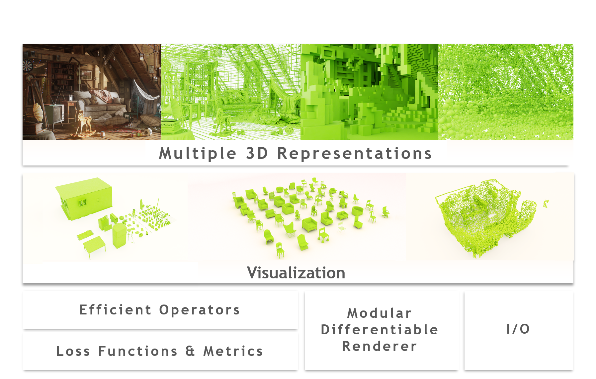
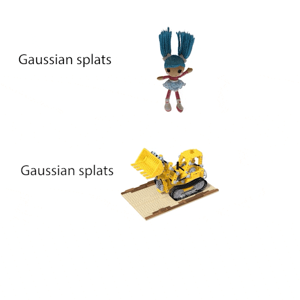
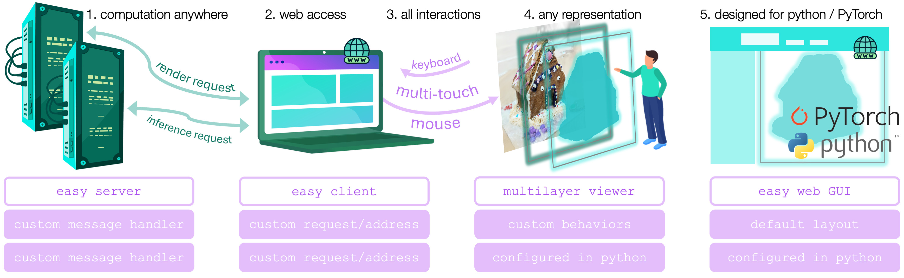
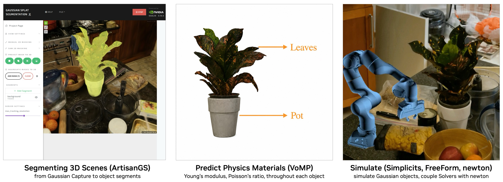

# Kaolin: A PyTorch Library for Accelerating 3D Deep Learning Research

> **TL;DR** — Kaolin is NVIDIA's PyTorch library of reusable, GPU-optimized modules distilled from 3D deep learning research.
>
> - Representation-agnostic **physics** (meshes, splats, point clouds) with Simplicits
> - **Differentiable rendering** (DIB-R, nvdiffrast, easy_render PBR)
> - First-class **3D Gaussian splats** (PLY/USD I/O, densification, gsplat bridge)
> - GPU **octree** acceleration structure: Structured Point Clouds (SPC)
> - **Conversions** between 3D representations, **quaternion** ops, and **USD** I/O

<p align="center">
  
  
</p>

[](https://kaolin.readthedocs.io/en/latest/)
[](https://github.com/NVIDIAGameWorks/kaolin/releases)
[](LICENSE)
[](https://developer.nvidia.com/kaolin)

Kaolin packages reusable building blocks from NVIDIA 3D research into a cohesive PyTorch API — continuously improving representation-agnostic physics simulation, fast conversions between representations, quaternion math, batched mesh and splat containers, I/O, visualization and more. See [kaolin.readthedocs.io](https://kaolin.readthedocs.io/en/latest/) for tutorials and API reference, and [developer.nvidia.com/kaolin](https://developer.nvidia.com/kaolin) for the NVIDIA Kaolin hub.

## SIGGRAPH 2026

Join us in Los Angeles! Two sessions showcasing new Kaolin capabilities. [Full details here](https://kaolin.readthedocs.io/en/latest/notes/siggraph2026.html).

<table>
<tr>
<td width="50%" valign="top">

<a href="https://s2026.conference-schedule.org/presentation/?id=gensub_229&sess=sess169">

</a>

**Talk — Any Representation, Any Hardware, All Interactions**

Accelerating Interactive Prototypes Over Cutting Edge AI & 3D Research

Sun **19 Jul 2026**, 3:00–3:20 pm PDT · Room **408 A**

Maria Shugrina (NVIDIA / University of Toronto)

Introduces Kaolin's new **web client-server framework** (`kaolin/visualize/dash`) for rapid prototyping of interactive browser interfaces over emerging AI and 3D research — patterns distilled from building interactive tools at SIGGRAPH technical papers, Real-Time Live, and Labs. Available on the [`web_framework_prerelease` branch](https://github.com/NVIDIAGameWorks/kaolin/tree/web_framework_prerelease) (not yet merged to `master`).

[Schedule →](https://s2026.conference-schedule.org/presentation/?id=gensub_229&sess=sess169)

</td>
<td width="50%" valign="top">

<a href="https://s2026.conference-schedule.org/presentation/?id=gensub_123&sess=sess257">

</a>

**Hands-on Lab — From 3D Captures to Simulated Digital Environments**

Thu **23 Jul 2026**, 10:15–11:45 am PDT · **Concourse Hall**

Clement Fuji Tsang, Vismay Modi, Maria Shugrina (NVIDIA)

A **capture-to-simulation pipeline** for in-the-wild 3D Gaussian Splat scenes: segment objects, predict volumetric mechanical properties, run mixed splat–mesh physics — powered by recent Kaolin features. Export shareable **USD files with Kaolin's custom physics schema**.

**Bring your laptop** and follow along hands-on. Full Conference badge required.

[Schedule →](https://s2026.conference-schedule.org/presentation/?id=gensub_123&sess=sess257)

</td>
</tr>
</table>

## Features

<table>
<tr>
<td width="33%" valign="top">

**Physics (Simplicits)**

Simulate meshes, splats, and point clouds with collisions. Warp-accelerated, representation-agnostic.

[Docs](https://kaolin.readthedocs.io/en/latest/notes/simplicits.html) ·
[Mesh](examples/tutorial/physics/simplicits_mesh.ipynb) ·
[Splat](examples/tutorial/physics/simplicits_gaussians_splatting.ipynb) ·
[3DGRUT](examples/tutorial/physics/simulatable_3dgrut.ipynb)

</td>
<td width="33%" valign="top">

**3D Gaussian Splats**

`GaussianSplatModel`, PLY/USD I/O, densification, gsplat camera converters.

[Tutorial](examples/tutorial/working_with_gaussians.ipynb) ·
[Simulate](examples/tutorial/physics/simplicits_gaussians_splatting.ipynb) ·
[Interactive viz](examples/tutorial/nerfstudio_gsplat_interactive_visualizer.ipynb)

</td>
<td width="33%" valign="top">

**Differentiable Rendering**

DIB-R, nvdiffrast, `easy_render` PBR, spherical harmonics and spherical gaussians lighting.

[Docs](https://kaolin.readthedocs.io/en/latest/notes/diff_render.html) ·
[DIB-R](examples/tutorial/dibr_tutorial.ipynb) ·
[Easy render](examples/tutorial/easy_mesh_render.ipynb) ·
[Camera](examples/tutorial/camera_and_rasterization.ipynb) ·
[Lighting](https://kaolin.readthedocs.io/en/latest/notes/differentiable_lighting.html)

</td>
</tr>
<tr>
<td width="33%" valign="top">

**Structured Point Clouds**

GPU octree acceleration structure with ray tracing and feature grids.

[Docs](https://kaolin.readthedocs.io/en/latest/notes/spc_summary.html) ·
[Tutorial](examples/tutorial/understanding_spcs_tutorial.ipynb) ·
[API](https://kaolin.readthedocs.io/en/latest/modules/kaolin.ops.spc.html)

</td>
<td width="33%" valign="top">

**USD Pipeline**

Import/export meshes, point clouds, gaussians, and physics materials with Kaolin's custom schema.

[API](https://kaolin.readthedocs.io/en/latest/modules/kaolin.io.usd.html) ·
[Checkpoints](https://kaolin.readthedocs.io/en/latest/notes/checkpoints.html) ·
[GLTF viz](examples/tutorial/gltf_viz.ipynb)

</td>
<td width="33%" valign="top">

**Visualization**

Jupyter 3D viewer, Timelapse checkpoints, and web client-server framework.

[Docs](https://kaolin.readthedocs.io/en/latest/notes/visualizer.html) ·
[Interactive](examples/tutorial/interactive_visualizer.ipynb) ·
[Checkpoints](https://kaolin.readthedocs.io/en/latest/notes/checkpoints.html) ·
[Web framework branch](https://github.com/NVIDIAGameWorks/kaolin/tree/web_framework_prerelease)

</td>
</tr>
<tr>
<td width="33%" valign="top">

**Conversions**

Fast GPU conversions between meshes, voxel grids, point clouds, gaussians, and more.

[Docs](https://kaolin.readthedocs.io/en/latest/notes/conversions.html) ·
[DMTet](examples/tutorial/dmtet_tutorial.ipynb) ·
[FlexiCubes](https://kaolin.readthedocs.io/en/latest/notes/volumetric_meshes.html)

</td>
<td width="33%" valign="top">

**Quaternions**

Differentiable quaternion and rigid-transform utilities for 3D deep learning.

[Docs](https://kaolin.readthedocs.io/en/latest/notes/quaternions.html) ·
[Tutorial](examples/tutorial/quaternion_tutorial.ipynb) ·
[API](https://kaolin.readthedocs.io/en/latest/modules/kaolin.math.html)

</td>
<td width="33%" valign="top">

**Surface Meshes**

Batched `SurfaceMesh` container with auto-computed attributes and I/O.

[Docs](https://kaolin.readthedocs.io/en/latest/notes/surface_meshes.html) ·
[Tutorial](examples/tutorial/working_with_meshes.ipynb) ·
[Easy render](examples/tutorial/easy_mesh_render.ipynb)

</td>
</tr>
</table>

*Experimental:* [Newton coupling](kaolin/experimental/newton/README.md) — Simplicits soft bodies with rigid bodies, MPM, and articulated robots
([rigid](examples/tutorial/physics/newton_rigidbody_coupling.ipynb) ·
[MPM](examples/tutorial/physics/newton_mpm_coupling_oneway.ipynb) ·
[Franka](examples/tutorial/physics/newton_franka_coupling.ipynb)).

See the [tutorial index](https://kaolin.readthedocs.io/en/latest/notes/tutorial_index.html) and [API reference](https://kaolin.readthedocs.io/en/latest/) at [kaolin.readthedocs.io](https://kaolin.readthedocs.io/en/latest/).

## Installation

Starting with v0.12.0, Kaolin supports installation with pre-built wheels:

```bash
# Replace TORCH_VERSION and CUDA_VERSION with your torch / cuda versions
pip install kaolin==0.18.0 -f https://nvidia-kaolin.s3.us-east-2.amazonaws.com/torch-{TORCH_VERSION}_cu{CUDA_VERSION}.html
```

For example, kaolin 0.18.0 with PyTorch 2.8.0 and CUDA 12.8:

```bash
pip install kaolin==0.18.0 -f https://nvidia-kaolin.s3.us-east-2.amazonaws.com/torch-2.8.0_cu128.html
```

See the [installation guide](https://kaolin.readthedocs.io/en/latest/notes/installation.html) for the full torch/CUDA compatibility matrix and [source install](https://kaolin.readthedocs.io/en/latest/notes/installation.html#install-from-source) instructions.

```bash
python -c "import kaolin; print(kaolin.__version__)"
```

## Quickstart

```python
import kaolin
print(kaolin.__version__)
```

Load a 3D Gaussian splat from PLY or USD:

```python
import kaolin
from kaolin.rep import GaussianSplatModel

gs = kaolin.io.import_gaussiancloud("scene.ply")
print(gs)  # GaussianSplatModel with positions, scales, rotations, opacities, ...
```

Simulate a mesh with Simplicits — see the [physics tutorial](examples/tutorial/physics/simplicits_mesh.ipynb).

Render a mesh with the easy PBR API:

```python
import kaolin as kal

mesh = kal.io.obj.import_mesh("model.obj")
camera = kal.render.easy_render.default_camera(512)
lighting = kal.render.easy_render.default_lighting()
result = kal.render.easy_render.render_mesh(camera, mesh, lighting=lighting)
```

## News

### Unreleased (master or staging)

Recent work on `master` since [v0.18.0](https://github.com/NVIDIAGameWorks/kaolin/releases/tag/v0.18.0):

- **[FreeForm / RKPM](https://research.nvidia.com/labs/sil/projects/freeform/)** (CVPR 2026) — mesh-free, reduced-order deformable simulation for meshes and Gaussian splats. Builds skinning eigenmodes with a Reproducing Kernel Particle Method (RKPM) basis instead of per-shape neural-field optimization — about **40× faster training** and lower error vs. FEM. Now integrated in Kaolin Simplicits.
- **Web client-server framework** (`kaolin/visualize/dash`) — rapid prototyping of interactive Web UIs over AI and 3D research ([`web_framework_prerelease` branch](https://github.com/NVIDIAGameWorks/kaolin/tree/web_framework_prerelease); [SIGGRAPH 2026 talk](https://s2026.conference-schedule.org/presentation/?id=gensub_229&sess=sess169))
- **`GaussianSplatModel`** and **`PointSamples`** tensor-container API
- **PLY/USD gaussian I/O** with feature preservation
- **USD physics schema** — materials, skinned physics, subset features
- **gsplat** batched camera converters
- **Newton coupling** — soft bodies with rigid/MPM/Franka ([notebooks](examples/tutorial/physics/newton_rigidbody_coupling.ipynb))
- **Simplicits Easy API** save/load redesign and collision friction fixes
- **FlexiCubes** now Apache 2.0 at [`kaolin/ops/conversions/flexicubes/`](kaolin/ops/conversions/flexicubes/flexicubes.py)

### v0.18.0 highlights

- [Collisions](https://kaolin.readthedocs.io/en/latest/modules/kaolin.physics.simplicits.html#kaolin.physics.simplicits.SimplicitsScene.enable_collisions) in the physics module
- [3D gaussians → voxelgrid](https://kaolin.readthedocs.io/en/latest/modules/kaolin.ops.conversions.html#kaolin.ops.conversions.gs_to_voxelgrid) conversion and volume densifier
- [Mesh + gaussian physics with 3DGRUT rendering](examples/tutorial/physics/simulatable_3dgrut.ipynb)
- FlexiCubes relicensed to Apache 2.0

See [release notes](https://github.com/NVIDIAGameWorks/kaolin/releases/tag/v0.18.0) for details.

## Tutorials

Notebooks live under [`examples/tutorial/`](examples/tutorial/). Highlights by topic:

**Physics**
- [Simulate a mesh with Simplicits](examples/tutorial/physics/simplicits_mesh.ipynb)
- [Simulate a Gaussian splat](examples/tutorial/physics/simplicits_gaussians_splatting.ipynb)
- [Mesh + splat physics with 3DGRUT](examples/tutorial/physics/simulatable_3dgrut.ipynb)
- [Newton rigid-body coupling](examples/tutorial/physics/newton_rigidbody_coupling.ipynb)

**Gaussians**
- [Working with GaussianSplatModel](examples/tutorial/working_with_gaussians.ipynb)

**Rendering**
- [DIB-R differentiable rendering](examples/tutorial/dibr_tutorial.ipynb)
- [Easy mesh render](examples/tutorial/easy_mesh_render.ipynb)
- [Camera and rasterization](examples/tutorial/camera_and_rasterization.ipynb)

**Structured Point Clouds**
- [Understanding SPCs](examples/tutorial/understanding_spcs_tutorial.ipynb)

**Visualization**
- [Interactive visualizer](examples/tutorial/interactive_visualizer.ipynb)
- [GLTF visualization](examples/tutorial/gltf_viz.ipynb)

Full index: [tutorial index](https://kaolin.readthedocs.io/en/latest/notes/tutorial_index.html).

## Ecosystem

Projects built with Kaolin:

- [**FreeForm / RKPM**](https://research.nvidia.com/labs/sil/projects/freeform/) — mesh-free reduced-order simulation via RKPM skinning eigenmodes (CVPR 2026)
- [**VoMP**](https://research.nvidia.com/labs/sil/projects/vomp/) — feed-forward volumetric mechanical property fields for splats, meshes, and NeRFs (ICLR 2026)
- [**ArtisanGS**](https://research.nvidia.com/labs/sil/projects/ArtisanGS/) — interactive Gaussian splat selection and segmentation with AI + human in the loop
- [**TRON**](https://research.nvidia.com/labs/sil/projects/tron/) — relightable 3D Gaussian reconstructions with a single-step neural renderer
- [**3DGRUT**](https://github.com/nv-tlabs/3DGRUT) — ray tracing and hybrid rasterization of Gaussian particles
- [**3DGUT**](https://research.nvidia.com/labs/toronto-ai/3DGUT/) — joint mesh and Gaussian splat rendering (CVPR 2025 oral)
- [**Diffusion Texture Painting**](https://research.nvidia.com/labs/toronto-ai/DiffusionTexturePainting/) — interactive diffusion-based texture painting on 3D meshes (SIGGRAPH 2024)
- [**NVIDIA Kaolin Wisp**](https://github.com/NVIDIAGameWorks/kaolin-wisp) — neural fields engine (NeRF, NGLOD, instant-ngp)
- [**gsplat**](https://github.com/nerfstudio-project/gsplat) — CUDA Gaussian splatting with Kaolin camera bridge
- [**NVIDIA Newton**](https://newton-physics.github.io/newton/) — physics engine with experimental [Kaolin coupling](kaolin/experimental/newton/README.md)
- [**Neural Geometric LOD (nglod)**](https://github.com/nv-tlabs/nglod) — SPC ray tracing
- [**FlexiCubes**](https://github.com/nv-tlabs/FlexiCubes) — gradient-based mesh extraction (SIGGRAPH 2023)
- [**DefTet**](https://github.com/nv-tlabs/DefTet) — deformable tetrahedral mesh reconstruction
- [**DIB-R**](https://github.com/nv-tlabs/DIB-R-Single-Image-3D-Reconstruction) — single-image 3D reconstruction
- [**gradSim**](https://github.com/gradsim/gradsim) — differentiable simulation
- [**Text2Mesh**](https://github.com/threedle/text2mesh) — text-driven mesh stylization

## Contributing

Please review our [contribution guidelines](CONTRIBUTING.md).

## License

Kaolin is released under the [Apache License 2.0](LICENSE). A default `import kaolin` gives you the full Apache-licensed library.

The [`kaolin/non_commercial/`](kaolin/non_commercial/) package is **legacy only** — kept for backward compatibility with older import paths (e.g. the pre-Apache FlexiCubes copy). New code should use the Apache-licensed modules under `kaolin/ops/`, `kaolin/rep/`, and the rest of the package tree.

## Citation

If you use Kaolin in your research, please cite:

```bibtex
@software{KaolinLibrary,
  author  = {Tsang, Clement Fuji and Shugrina, Maria and Lafleche, Jean-Francois and Perel, Or and Loop, Charles and Takikawa, Towaki and Modi, Vismay and Zook, Alexander and Wang, Jiehan and Chen, Wenzheng and Shen, Tianchang and Gao, Jun and Jatavallabhula, Krishna Murthy and Smith, Edward and Rozantsev, Artem and Fidler, Sanja and State, Gavriel and Gorski, Jason and Xiang, Tommy and Li, Jianing and Li, Michael and Lebaredian, Rev},
  title   = {{Kaolin: A PyTorch Library for Accelerating 3D Deep Learning Research}},
  version = {0.18.0},
  date    = {2024-11-20},
  url     = {https://github.com/NVIDIAGameWorks/kaolin}
}
```

## Contributors

**Current team:** Clement Fuji Tsang (Technical Lead), Maria (Masha) Shugrina (Manager), Charles Loop, Vismay Modi, Or Perel

**Other major contributors:** Alexander Zook, Donglai Xiang, Wenzheng Chen, Sanja Fidler, Jun Gao, Jason Gorski, Jean-Francois Lafleche, Rev Lebaredian, Jianing Li, Michael Li, Krishna Murthy Jatavallabhula, Artem Rozantsev, Tianchang (Frank) Shen, Edward Smith, Gavriel State, Towaki Takikawa, Jiehan Wang, Tommy Xiang
