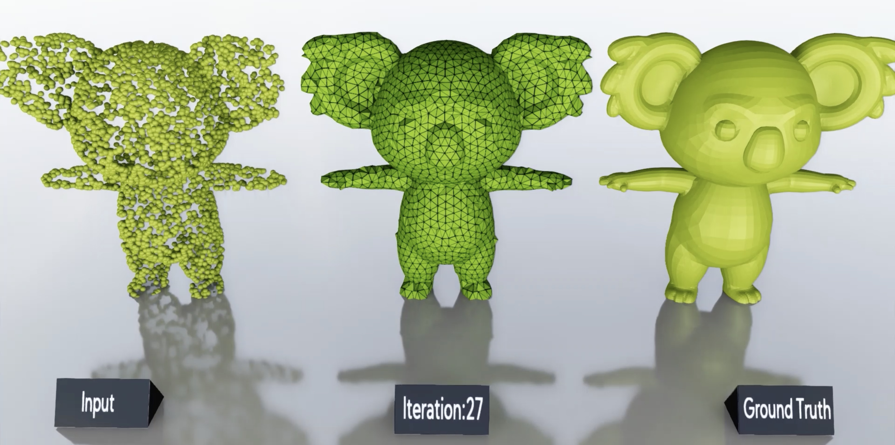
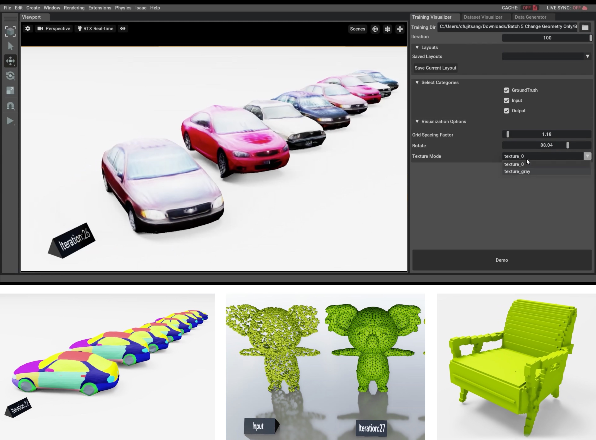
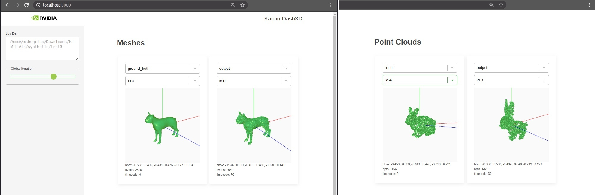

.. _3d_viz:

3D Checkpoint Visualization
===========================

Visualizing 3D inputs and outputs of your model during training is an
essential diagnostic tool. Kaolin provides a :ref:`simple API to checkpoint<writing checkpoints>` **batches of meshes, pointclouds and voxelgrids**, as well as **colors and
textures**, saving them in :ref:`the USD format<file format>`. These checkpoints can then be visualized locally using :ref:`Kaolin Omniverse App<ov app>` or by launching :ref:`Kaolin Dash3D<dash 3d>` on the commandline, allowing remote visualization through a web browser.

.. _writing checkpoints:

Writing Checkpoints:
--------------------

In a common scenario, model performance is visualized for a
small evaluation batch. Bootstrap 3D checkpoints in your python training
code by configuring a :class:`~kaolin.visualize.Timelapse` object::

    import kaolin
    timelapse = kaolin.visualize.Timelapse(viz_log_dir)

The ``viz_log_dir`` is the directory where checkpoints will be saved. Timelapse will create files and subdirectories under this path, so providing
a dedicated ``viz_log_dir`` separate from your other logs and configs will help keep things clean. The :class:`~kaolin.visualize.Timelapse` API supports point clouds,
voxel grids and meshes, as well as colors and textures.

Saving Fixed Data
^^^^^^^^^^^^^^^^^

To save any iteration-independent data,
call ``timelapse`` before your training loop
without providing an ``iteration`` parameter, e.g.::

    timelapse.add_mesh_batch(category='ground_truth',
                             faces_list=face_list,
                             vertices_list=gt_vert_list)
    timelapse.add_pointcloud_batch(category='input',
                                   pointcloud_list=input_pt_clouds)

The ``category`` identifies the meaning of the data. In this toy example,
the model learns to turn the ``'input'`` pointcloud into the ``'output'`` mesh. Both the ``'ground_truth'`` mesh and the ``'input'`` pointcloud batches are only saved once for easy visual comparison.

Saving Time-varying Data
^^^^^^^^^^^^^^^^^^^^^^^^
To checkpoint time-varying data during training, simply call :meth:`~kaolin.visualize.Timelapse.add_mesh_batch`, :meth:`~kaolin.visualize.Timelapse.add_pointcloud_batch` or :meth:`~kaolin.visualize.Timelapse.add_voxelgrid_batch`, for example::

    if iteration % checkpoint_interval == 0:
        timelapse.add_mesh_batch(category='output',
                                 iteration=iteration,
                                 faces_list=face_list,
                                 vertices_list=out_vert_list)

.. Tip::
    For any data type, only time-varying data needs to be saved at every iteration. E.g., if your output mesh topology is fixed, only save ``faces_list`` once, and then call ``add_mesh_batch`` with only the predicted ``vertices_list``. This will cut down your checkpoint size.

Saving Colors and Appearance
^^^^^^^^^^^^^^^^^^^^^^^^^^^^

We are working on adding support for colors and semantic ids to
point cloud and voxel grid checkpoints. Mesh API supports multiple time-varying materials
by specifying a :class:`kaolin.io.PBRMaterial`. For an example
of using materials, see
`test_timelapse.py <https://github.com/NVIDIAGameWorks/kaolin/blob/master/tests/python/kaolin/visualize/test_timelapse.py>`_. 

Sample Code
^^^^^^^^^^^
We provide a `script <https://github.com/NVIDIAGameWorks/kaolin/blob/master/examples/tutorial/visualize_main.py>`_ that writes mock checkpoints, which can be run as follows::

    python examples/tutorial/visualize_main.py \
        --test_objs=path/to/object1.obj,path/to/object2.obj \
        --output_dir=path/to/logdir

In addition, see :ref:`diff_render` tutorial.

.. _file format:

Understanding the File Format:
------------------------------

Kaolin :class:`~kaolin.visualize.Timelapse` writes checkpoints using Universal Scene Descriptor (USD) file format (`Documentation <https://graphics.pixar.com/usd/docs/index.html>`_), developed with wide support for use cases in visual effects, including time-varying data. This allows reducing redundancy in written
data across time.

After checkpointing with :class:`~kaolin.visualize.Timelapse`, the input ``viz_log_dir`` will contain
a similar file structure::

    ground_truth/mesh_0.usd
    ground_truth/mesh_1.usd
    ground_truth/mesh_...
    ground_truth/textures
    input/pointcloud_0.usd
    input/pointcloud_1.usd
    input/pointcloud_...
    output/mesh_0.usd
    output/mesh_1.usd
    output/mesh_...
    output/pointcloud_0.usd
    output/pointcloud_1.usd
    output/pointcloud_...
    output/textures

Here, the root folder names correspond to the ``category`` parameter
provided to :class:`~kaolin.visualize.Timelapse` functions. Each element
of the batch of every type is saved in its own numbered ``.usd`` file. Each USD file can be viewed on its
own using any USD viewer, such as `NVIDIA Omniverse View <https://www.nvidia.com/en-us/omniverse/apps/view/>`_, or the whole log directory can be visualized
using the tools below.

.. Caution::
    Timelapse is designed to only save one visualization batch for every category and type. Saving multiple batches without interleaving the data can be accomplished by creating custom categories.

.. _ov app:

Visualizing with Kaolin Omniverse App:
--------------------------------------

USD checkpoints can be visualized using a dedicated Omniverse Kaolin App `Training Visualizer <https://docs.omniverse.nvidia.com/app_kaolin/app_kaolin/user_manual.html#training-visualizer>`_.
This extension provides full-featured support and high-fidelity rendering
of all data types and materials that can be exported using :class:`~kaolin.visualize.Timelapse`, and allows creating custom visualization layouts and viewing meshes in multiple time-varying materials. `Download NVIDIA Omniverse <https://www.nvidia.com/en-us/omniverse/>`_ to get started!

.. _dash 3d:

Visualizing with Kaolin Dash3D:
-------------------------------

Omniverse app requires local access to a GPU and to the saved checkpoints, which is not always possible.
We are also developing a lightweight ``kaolin-dash3d`` visualizer,
which allows visualizing local and remote checkpoints without specialized
hardware or applications. This tool is bundled with the latest
builds as a command-line utility

To start Dash3D on the machine that stores the checkpoints, run::

    kaolin-dash3d --logdir=$TIMELAPSE_DIR --port=8080

The ``logdir`` is the directory :class:`kaolin.visualize.Timelapse` was configured with. This command will launch a web server that will stream
geometry to web clients. To connect, simply visit ``http://ip.of.machine:8080`` (or `localhost:8080 <http://localhost:8080/>`_ if connecting locally or with ssh port forwarding).

Try it now:
^^^^^^^^^^^^^

See Dash3D in action by running it on our test samples and visiting `localhost:8080 <http://localhost:8080/>`_::

    kaolin-dash3d --logdir=$KAOLIN_ROOT/tests/samples/timelapse/notexture/ --port=8080

.. Caution:: Dash3d is still an experimental feature under active development. It only supports **triangle meshes** and **pointclouds** and cannot yet visualize colors, ids or textures. The web client was tested the most on `Google Chrome <https://www.google.com/chrome/>`_. We welcome your early feedback on our `github <https://github.com/NVIDIAGameWorks/kaolin/issues>`_!
