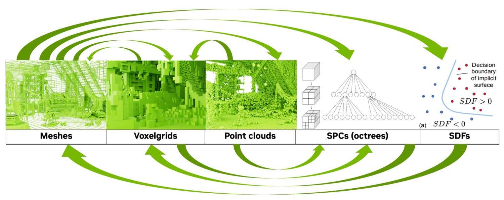

Conversions across 3D Representations
*************************************

.. _rep_conversions:

Kaolin Library supports conversions between many 3D representations commonly used for deep learning with a plain PyTorch API.

From Mesh
=========

* mesh to pointcloud:
   * :any:`kaolin.ops.mesh.sample_points`
   * :any:`kaolin.ops.mesh.packed_sample_points`
* mesh to voxels:
   * :any:`kaolin.ops.conversions.trianglemeshes_to_voxelgrids`
* mesh to octree (:ref:`Structured Point Clouds <spc>` or SPC):
   * :any:`kaolin.ops.conversions.unbatched_mesh_to_spc`

From Signed Distance Field (SDF)
================================

* SDF to tetrahedral mesh:
   * :any:`kaolin.ops.conversions.marching_tetrahedra`
* SDF to voxelgrid:
   * :any:`kaolin.ops.conversions.pointclouds_to_voxelgrids`

From Point Cloud
================

* point cloud to voxels:
   * :any:`kaolin.ops.conversions.pointclouds_to_voxelgrids`
* point cloud to octree (:ref:`Structured Point Clouds <spc>` or SPC):
   * :any:`kaolin.ops.conversions.unbatched_pointcloud_to_spc`

From Voxels
===========

* point cloud to mesh:
   * :any:`kaolin.ops.conversions.voxelgrids_to_cubic_meshes`
   * :any:`kaolin.ops.conversions.voxelgrids_to_trianglemeshes`

Hybrid Representations
======================

* SDF and voxelgrid to tetrahedral mesh:
   * :any:`kaolin.non_commercial.FlexiCubes` (See also :ref:`Volumetric Mesh Optimization <volumetric_meshes>`)
