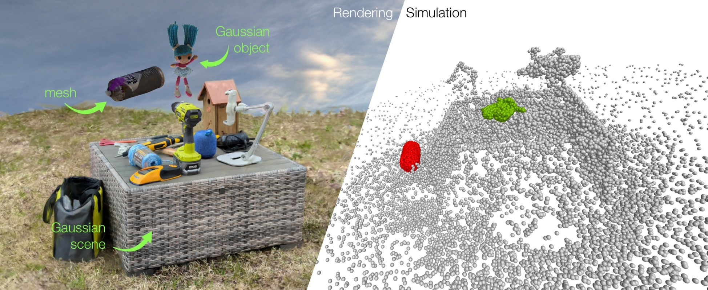
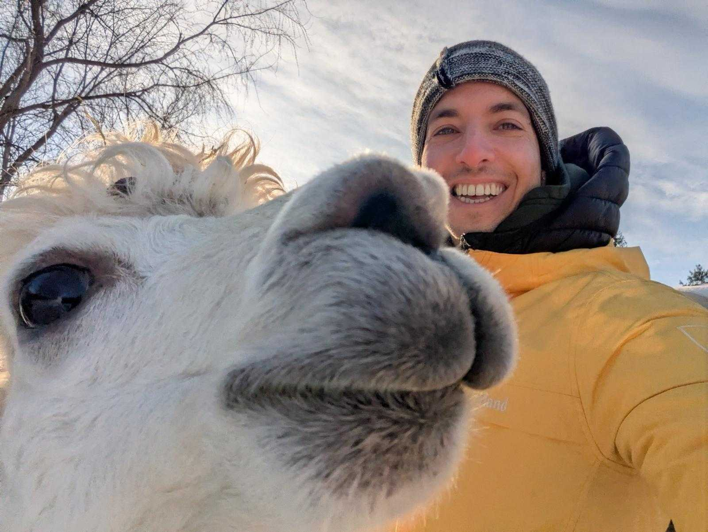

CVPR 2025 Tutorial
==================

.. raw:: html

    <h2 class='green'>3D Deep Learning, Gaussian Splats and Physics Simulation 
    a Hands-On Lab with NVIDIA Kaolin Library
    </h2>

.. raw:: html

    

        

            <h4><a href="#cvpr2025-attend">Attend</a></h4>
        

        

            <h4><a href="#cvpr2025-content">Content</a></h4>
        

        

            <h4><a href="#cvpr2025-organizers">Organizers</a></h4>
        

        

            <h4><a href="#cvpr2025-run-it-yourself">Run It Yourself</a></h4>
        

    

Bring your laptop to this hands-on course from basics to the bleeding edge of 3D research,
powered by a dedicated GPU back end for each user and NVIDIA Kaolin Library, a PyTorch-based toolkit for fast,
GPU-optimized operations and interactive applications on Gaussian splats, meshes, and volumetric data.
This lab will focus on new research allowing interactive physics simulation with contact for 3D Gaussian Splats and meshes,
rendered jointly using latest advances (`3DGUT <https://github.com/nv-tlabs/3dgrut>`_, a CVPR oral) and viewed interactively in a Jupyter notebook.
Complete coding examples are released together with this tutorial, and are supported by Kaolin Library v0.18.0.

.. _cvpr2025 attend:

When & Where:
-------------

Join us in Nashville, Tennessee on **Wednesday, June 11th, 8AM-noon CDT during CVPR 2025**.
See the `Official Schedule <https://cvpr.thecvf.com/virtual/2025/tutorial/35901>`_ for room location.

Don't forget to bring your laptop!

.. _cvpr2025 content:

Content:
--------

.. rst-class:: wrap-table

.. list-table:: Approximate Tutorial Schedule
   :widths: 20 35 45
   :header-rows: 1

   * - Time
     - Topic
     - Supporting Materials
   * - 8-8:15am
     - Introduction
     - `Kaolin Documentation <https://kaolin.readthedocs.io/en/latest/>`_
   * - 8:15-8:30am
     - Setting up on the cluster
     - Per-attendee GPU back end reserved by the `Deep Learning Institute <https://www.nvidia.com/en-us/training/>`_
   * - 8:30-9:15am
     - Kaolin basics (hands on)
     - Load and manipulate mesh attributes and PBR materials, control cameras, differentiable rendering, interactive viewing of any render function. See `notebook <https://github.com/NVIDIAGameWorks/kaolin/blob/master/examples/tutorial/gltf_viz.ipynb>`__.
   * - 9:15-10:00am
     - Introduction to Kaolin Physics simulation (hands on)
     - Learn theoretical background on representation-agnostic physics simulation method `Simplicits <https://research.nvidia.com/labs/toronto-ai/simplicits/>`_, and the :ref:`API <physics_simulation>` for its latest implementation in Kaolin, now accelerated with `NVIDIA Warp <https://github.com/NVIDIA/warp>`_. See `notebook <https://github.com/NVIDIAGameWorks/kaolin/blob/master/examples/tutorial/physics/simplicits_easy_api.ipynb>`__.
   * - 10-10:20am
     - Break
     - At least one lecturer will be available to help or answer questions. **New attendees can join at this point.**
   * - 10:20-11am
     - Physics simulation for 3D Gaussian Splat objects with collisions, interactive viewing in Jupyter (hands-on)
     - Directly simulate 3D Gaussian Splat objects and view them interactively within a Jupyter notebook. Enable **collision resolution** between objects. Theoretical primer on collisions. See `notebook <https://github.com/NVIDIAGameWorks/kaolin/blob/master/examples/tutorial/physics/simplicits_inria_splatting.ipynb>`__ (to be updated soon!). Previous version (slower, no collisions) covered in this `video <https://www.youtube.com/watch?v=BaTlXbIXK30&list=PLalVOiLxaOcUjbn-EQ8iEnUBbWf9uY_-k>`_.
   * - 11-11:45am
     - 3D Gaussians and meshes simulated and rendered together (hands-on)
     - Add meshes to the mix and simulate meshes and Gaussian-based radiance fields together, interactively view and jointly render them using latest research advances from `NVIDIA 3DGUT <https://github.com/nv-tlabs/3dgrut>`_, a CVPR oral. See `notebook <https://github.com/NVIDIAGameWorks/kaolin/blob/master/examples/tutorial/physics/simulatable_3dgrut.ipynb>`_ (coming soon!). Discussion of open problems.
   * - 11:45am-noon
     - Q & A
     - Instructors available for help with individual coding examples.

.. _cvpr2025 run it yourself:

Run It Yourself:
----------------

Environment and instructions for running notebooks linked above will be provided shortly.

Subscribe to `Kaolin github repository <https://github.com/NVIDIAGameWorks/kaolin>`_ to get notified when v0.18.0 is released with easy-to-install wheels.

.. _cvpr2025 organizers:

Organizers:
-----------

.. image:: ../img/people/vismay.jpg
  :height: 0px
  :width: 0px

.. image:: ../img/people/clement.jpg
  :height: 0px
  :width: 0px

.. image:: ../img/people/masha_kaleidoscope.jpg
  :height: 0px
  :width: 0px

.. raw:: html

    

        
        

            <h3>Clement Fuji Tsang</h3>
            
Clement is a Senior Research Scientist at NVIDIA, leading Kaolin Library development
             and working on Deep Learning applied to 3D and computer vision. Previously Clement was working on operators
            fusion and TensorRT integration in MXNet, as well as large scale training of Deep Learning models.
            His current focus is to develop and share Deep Learning solutions that are efficient and scalable on GPUs for 3D,
            computer vision and NLP tasks. He has been presenting Kaolin at SIGGRAPH 2022, 2024, and multiple GTCs.

        

    

    

        
        

            <h3>Vismay Modi</h3>
            
Vismay is a Research Scientist at NVIDIA, working on Kaolin's representation-agnostic physics simulator.
            His focus is to enable interactive simulation of 3D objects in various representations, empowering artists,
            researchers and engineers to easily prototype, animate and simulate their generated or reconstructed 3D assets.
            His research goal is to ensure that simulation tools support a diverse set of interactive physics-based phenomena,
            including elasto-dynamics, muscle activation, joints, cloth, collisions with frictional contact, on any 3D representation,
            including NeRFs, 3D Gaussian splats, CT scans and more.

        

    

    

        
        

            <h3>Or Perel</h3>
            
Or is a Research Scientist at NVIDIA Toronto AI Lab and a Ph.D. student at the University of Toronto.
            Previously, he worked at Amazon Rekognition and Autodesk. He obtained his M.Sc. in Computer Sciences from Tel Aviv University,
            under the supervision of Prof. Daniel Cohen-Or. His research lies at the convergence of computer vision, graphics,
            and machine learning, with particular interest in AI-driven 3D simulations, including realistic reconstructions and
            interactive workflows for manipulating them.

        

    

    

        
        

            <h3>Masha (Maria) Shugrina </h3>
            
Masha is a Senior Research Scientist at the NVIDIA Toronto AI Lab, where she manages a subgroup focused on
            interactive applications of AI and on efforts to accelerate research, including the NVIDIA Kaolin Library.
            Her core research interest is advancing techniques that integrate AI into the interactive loop.
            She defended her PhD at the University of Toronto, and Master’s at MIT. She has also worked as a Research Engineer at Adobe
            and Senior Software Engineer and Tech Lead at Google.

        

    

