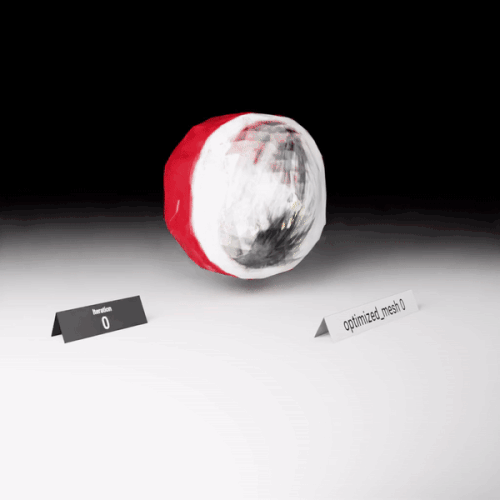

.. _diff_render:

Differentiable Rendering
========================

Differentiable rendering can be used to optimize the underlying 3D properties, like geometry and lighting, by backpropagating gradients from the loss in the image space. We provide an end-to-end tutorial for using the :mod:`kaolin.render.mesh` API in a Jupyter notebook:

`examples/tutorial/dibr_tutorial.ipynb <https://github.com/NVIDIAGameWorks/kaolin/blob/master/examples/tutorial/dibr_tutorial.ipynb>`_

In addition to the rendering API, the tutorial uses Omniverse Kaolin App `Data Generator <https://docs.omniverse.nvidia.com/app_kaolin/app_kaolin/user_manual.html#data-generator>`_ to create training data, :class:`kaolin.visualize.Timelapse` to write checkpoints, and
Omniverse Kaolin App `Training Visualizer <https://docs.omniverse.nvidia.com/app_kaolin/app_kaolin/user_manual.html#training-visualizer>`_ to visualize them.