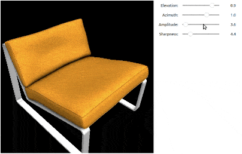
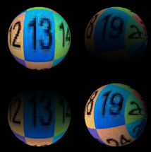

Differentiable Lighting
***********************

.. _differentiable_lighting:

Kaolin Library implements low-level Spherical Harmonic (``sh``) and Spherical Gaussian (``sg``) lighting, including diffuse and specular lighting effects.
These lighting models are different from light sources like point light and spot light, common in computer graphics, and instead approximate
a wide range of lighting conditions with a fixed number of optimizable parameters. For example, Spherical Gaussians are used in
`"DIB-R++: learning to predict lighting and material with a hybrid differentiable renderer." <https://research.nvidia.com/labs/toronto-ai/DIBRPlus/>`_ Chen, Wenzheng, Joey Litalien, Jun Gao, Zian Wang, Clement Fuji Tsang, Sameh Khamis, Or Litany, and Sanja Fidler. NeurIPS 2021.

See low-level lighting functions in :py:mod:`kaolin.render.lighting`, as well as :ref:`Easy PBR Shader <pbr_shader>`, which incorporates SphericalGaussian lighting
as an argument into an easy-to-render function for meshes.

Tutorials: Lighting Optimization
================================

Optimize Diffuse and Specular Lighting with Spherical Gaussians
^^^^^^^^^^^^^^^^^^^^^^^^^^^^^^^^^^^^^^^^^^^^^^^^^^^^^^^^^^^^^^^

The `examples/tutorial/sg_specular_lighting.ipynb <https://github.com/NVIDIAGameWorks/kaolin/blob/master/examples/tutorial/sg_specular_lighting.ipynb>`_
tutorial shows a synthetic example of optimizing for lighting effects represented as Spherical Gaussians using standard PyTorch optimizers and photometric loss.

.. raw:: html

   <iframe width="560" height="315" src="https://www.youtube.com/embed/BsUIFg5bt6I?si=nDq514_HanvWQS9U&amp;start=35" title="YouTube video player" frameborder="0" allow="accelerometer; autoplay; clipboard-write; encrypted-media; gyroscope; picture-in-picture; web-share" referrerpolicy="strict-origin-when-cross-origin" allowfullscreen></iframe>
   

Optimizing Diffuse Lighting
^^^^^^^^^^^^^^^^^^^^^^^^^^^

The `examples/tutorial/diffuse_lighting.ipynb <https://github.com/NVIDIAGameWorks/kaolin/blob/master/examples/tutorial/diffuse_lighting.ipynb>`_
tutorial shows how to optimize lighting parameters with spherical gaussians and spherical harmonics.

Tutorials: Visualization
========================

Other tutorials include Spherical Gaussian lighting with :any:`kaolin.render.easy_render.render_mesh` function, and show its usage for visualization and synthetic data rendering. For example:

* `GLTF Visualizer <https://github.com/NVIDIAGameWorks/kaolin/blob/master/examples/tutorial/gltf_viz.ipynb>`_ showing how to render GLTF / glb meshes, such as those from the Objaverse datset, with PBR materials and lighting.
* `Easy Mesh Render Tutorial <https://github.com/NVIDIAGameWorks/kaolin/blob/master/examples/tutorial/easy_mesh_render.ipynb>`_ showing how to render meshes from different formats with PBR materials and lighting.
