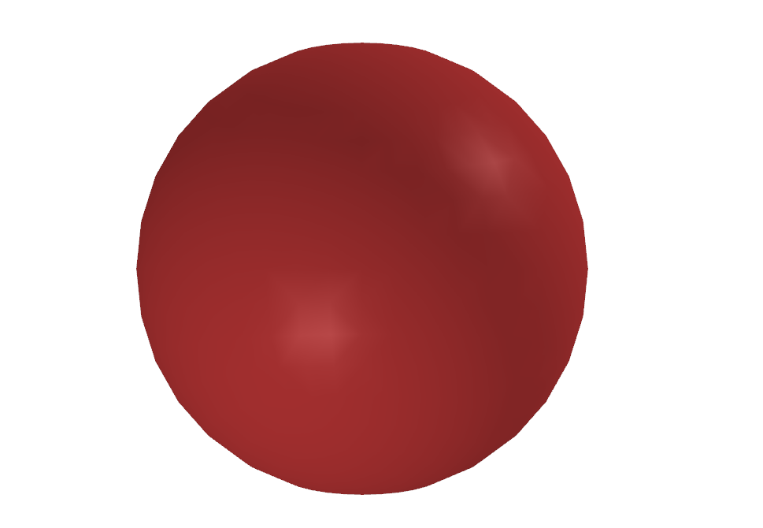

Hello, 3D world!
=====================

This tutorial will serve as a quick welcome to the 3D world! This assumes that you have downloaded and installed Kaolin. Fire up your python interpreter and import Kaolin.

.. code-block:: python

    >>> import kaolin as kal

Triangle meshes
------------------

To load up a triangle mesh in Kaolin, run the following command. For this tutorial, we will load the `model.obj` file inside of the `tests` directory (`tests` is contained in the base directory of the Kaolin repository).

.. code-block:: python

    >>> mesh = kal.rep.TriangleMesh.from_obj('model.obj')

A triangle mesh consists of a set of 3D vertices, and a set of faces (here, triangles) that connect them. To access the vertices and faces, run

.. code-block:: python

    >>> mesh.vertices.shape
    torch.Size([482, 3])
    >>> mesh.faces.shape
    torch.Size([482, 3])

Now, to visualize the mesh, simply call

.. code-block:: python

    >>> kal.visualize.show(mesh)

At this point, a window should pop up, and display a (surprise, surprise!) sphere.

Voxel grids
------------

Voxels are another popular 3D representation. Think of them as the 3D extension to pixels. In Kaolin, converting a mesh to a voxel grid is real easy. Just do

.. code-block:: python

    >>> voxels = kal.conversions.trianglemesh_to_voxelgrid(mesh, 32)

To visualize the voxel grid, run

.. code-block:: python

    >>> kal.visualize.show(voxels, mode='voxels')

You should see something like this.

.. image:: ../_static/img/hello3d/  hello3d_voxelgrid.png

Pointclouds
------------

Pointclouds are yet another popular 3D representation, where each point in a pointcloud represents a point on the surface of an object (usually in 3D).

Let's take the sphere mesh loaded above and convert it into a pointcloud. Note that Kaolin immplements this function differentiably, that is, you can backpropagate through this sampling process.

In the below code snippet, the additional argument `1000` denotes the number of points to be sampled (uniformly) from the surface of the mesh.

.. code-block:: python

    >>> points, _ = kal.conversions.trianglemesh_to_pointcloud(mesh, 1000)

Signed distance functions
--------------------------

The 3D representations that we saw thus far are referred to as _explicit_ surface representations (because meshes, pointclouds, and voxels explicitly represent points over the surface of a 3D object). Signed distance functions (SDFs) are _implicit_ surface representations, in that they do not explicitly represent the surface, but can be used to infer the position (and orientation) of the surface.

Here's how you can convert the mesh we loaded in earlier into an SDF.

.. code-block:: python

    >>> sdf = kal.conversions.trianglemesh_to_sdf(mesh)

This `sdf` is now a signed distance representation. We can use it, for example, to query distances for a bunch of points. Here's a sample query where we generate a random set of points and pass them through the signed distance function. This will return, for each point, distance of the point from the surface.
