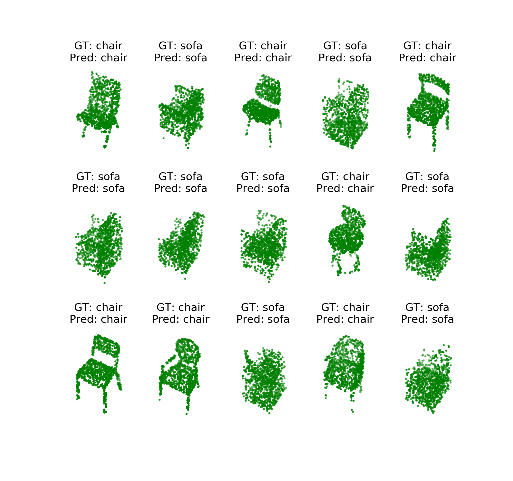

PointNet
==========

**Skill level: beginner**

Kaolin makes 3D deep learning easy, by providing all the *hard/tricky* parts of coding up a 3D DL application. To get a feel for how easy training classifiers on 3D data has become, here's a quick demo.

In this tutorial, we will train a *pointcloud classifier*!

For those who are new to *pointclouds*, here's how they look like.

.. image:: ../_static/img/planes_pc.png

We will use the *ModelNet10* dataset for the remainder of this tutorial.

Downloading ModelNet10
------------------------------------

Note that the ModelNet10 dataset is provided **ONLY** for the convenience of academic research. Should you choose to download it, you must adhere to the original terms and copyright notice of the dataset. For convenience, we reproduce the original copyright from the dataset creators.

.. note::
    **Copyright**
    All CAD models are downloaded from the Internet and the original authors hold the copyright of the CAD models. The label of the data was obtained by us via Amazon Mechanical Turk service and it is provided freely. This dataset is provided for the convenience of academic research only.

The ModelNet10 (10-class subset) dataset is available on the `Princeton ModelNet <https://modelnet.cs.princeton.edu/>`_ page. Once on this page, navigate to the ModelNet10 download link to obtain the dataset. We assume that it is unzipped and extracted to a location MODELNET_DIRECTORY.

Warm-up
----------

Before the fun-stuff begins, let us import all necessary functions from kaolin and torch. A bit more on what the following modules do will become clear as we progress.

.. code-block:: python

    import torch
    from torch.utils.data import DataLoader
    import kaolin as kal
    from kaolin import ClassificationEngine
    from kaolin.datasets import ModelNet
    from kaolin.models.PointNet import PointNetClassifier as PointNet
    import kaolin.transforms as tfs

Loading data
--------------

We will first define a few important parameters that specify dataset characteristics.

.. code-block:: python

    modelnet_path = 'path/to/ModelNet10/'
    categories = ['chair', 'sofa']
    num_points = 1024
    device = 'cuda'

The `model_path` variable holds the path to the ModelNet10 dataset. The classes of interest are specified in `categories`. `num_points` is the number of points each pointcloud will contain (ModelNet10 is actually a dataset comprising triangle meshes. We sample pointclouds from these meshes). Finally, we will use `device = 'cuda'` to tell pytorch to run everything on the GPU.

.. code-block:: python

    transform = tfs.Compose([
        tfs.TriangleMeshToPointCloud(num_samples=num_points),
        tfs.NormalizePointCloud()
    ])

This command defines a `transform` that first converts a mesh representation to a pointcloud and then normalizes it to be centered at the origin, and have a standard deviation of 1. Much like images, 3D data such as pointclouds need to be normalized for better classification performance.

.. code-block:: python    

    train_loader = DataLoader(ModelNet(modelnet_path, categories=categories,
                                       split='train', transform=transform, device=device),
                              batch_size=12, shuffle=True)

Phew, that was slightly long! But here's what it does. It creates a `DataLoader` object for the `ModelNet10` dataset. In particular, we are interested in loading only the `chair` and `sofa` categories. The `split='train'` argument indicates that we're loading the `train` split. The `rep='pointcloud'` loads up meshes and converts them into pointclouds. The `transform=norm` argument applies a normalizing transform to each pointcloud. The other parameters are fairly easy to decipher.

Similarly, the test dataset can be loaded up as follows.

.. code-block:: python

    val_loader = DataLoader(ModelNet(modelnet_path, categories=categories,
                                     split='test',transform=transform, device=device),
                            batch_size=12)

Training the pointcloud classifier
--------------------------------------

Now that all of the data is ready, we can train our classifier using the `ClassificationEngine` class provided by Kaolin. The following line of code will train and validate a PointNet classifier, which is probably the simplest of pointcloud neural architectures.

.. code-block:: python

    engine = ClassificationEngine(PointNet(num_classes=len(categories)),
                              train_loader, val_loader, device=device)
    engine.fit()

::

    Epoch: 0, Train loss: 0.7516997456550598, Train accuracy: 0.4166666865348816
    Epoch: 0, Train loss: 0.4403831958770752, Train accuracy: 0.7083333432674408
    Epoch: 0, Train loss: 0.3169098496437073, Train accuracy: 0.8055555621782938
    Epoch: 0, Train loss: 0.2660444527864456, Train accuracy: 0.8541666716337204
    Epoch: 0, Train loss: 0.220511943846941, Train accuracy: 0.8833333373069763
    Epoch: 0, Train loss: 0.18787472850332657, Train accuracy: 0.902777781089147
    Epoch: 0, Train loss: 0.19723672020648206, Train accuracy: 0.9047619104385376
    Epoch: 0, Train loss: 0.17526232870295644, Train accuracy: 0.9166666716337204
    ...
    Epoch: 9, Val loss: 0.00605057287029922, Val accuracy: 1.0
    Epoch: 9, Val loss: 0.006767688022757118, Val accuracy: 1.0
    Epoch: 9, Val loss: 0.006286513147642836, Val accuracy: 1.0
    Epoch: 9, Val loss: 0.005888640576113875, Val accuracy: 1.0
    Epoch: 9, Val loss: 0.00580307244256671, Val accuracy: 1.0
    Epoch: 9, Val loss: 0.005455126753076911, Val accuracy: 1.0
    Epoch: 9, Val loss: 0.005224122716754209, Val accuracy: 1.0
    Epoch: 9, Val loss: 0.005015887806246824, Val accuracy: 1.0

Visualizing the results
------------------------

We will create a new dataloder which will load the same data as our previous val_loader but with shuffling, and take a sample batch.

.. code-block:: python

    test_loader = DataLoader(ModelNet(modelnet_path, categories=categories,
                                 split='test',transform=transform, device=device),
                        shuffle=True, batch_size=15)
    test_batch, labels = next(iter(test_loader))
    preds = engine.model(test_batch)
    pred_labels = torch.max(preds, axis=1)[1]

Next, we setup a plot to visualize the pointcloud, groundtruth label and our prediction using a small utility function. Here we've also colour-coded the results - green for correct and red for incorrect.

.. code-block:: python

    from utils import visualize_batch
    visualize_batch(test_batch, pred_labels, labels, categories)

Bells and whistles!
-----------------------

The `ClassificationEngine` can be customized to suit your needs.

You can train on other categories by simply changing the `categories` argument passed to the ModelNet10 dataset object. For example, you can add a `bed` class by running

.. code-block:: python
    
    dataset = ModelNet('/path/to/ModelNet10', categories=['chair', 'sofa', 'bed'],
                    split='train', rep='pointcloud', transform=norm, device='cuda:0')

You can also configure the parameters of the `PointNet` to your liking. For a more detailed explanation, refer to the documentation of the `PointNetClassifier` class.

Further, you can pass several parameters that configure the learning rate, optimizer, training duration, and more. A detailed description can be accessed from the documentation for the `ClassificationEngine` class.
