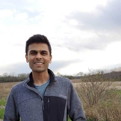

SIGGRAPH 2025 Tutorial
======================

.. raw:: html

    <h2 class='green'>Tackling Gaussian Splats, Physics Simulation, and Visualization With NVIDIA Kaolin and Warp Libraries 
    Hands-On Class
    </h2>

.. video:: ../videos/grut_spray_can_enc.mp4
  :height: 0
  :width: 0

.. video:: ../videos/flexisim.mp4
   :height: 0
   :width: 0

.. raw:: html

  

    <video controls autoplay width="36%">
      <source src="../_images/grut_spray_can_enc.mp4" type="video/mp4">
    </video>
    <video controls autoplay width="63%">
      <source src="../_images/flexisim.mp4" type="video/mp4">
    </video>
  

.. raw:: html

    

        

            <h4><a href="#siggraph2025-attend">Attend</a></h4>
        

        

            <h4><a href="#siggraph2025-content">Content</a></h4>
        

        

            <h4><a href="#siggraph2025-organizers">Organizers</a></h4>
        

        

            <h4><a href="#siggraph2025-run-it-yourself">Run It Yourself</a></h4>
        

    

Bring your laptop to this hands-on class from basics to the bleeding edge of 3D research,
powered by a dedicated GPU back end for each user and NVIDIA Kaolin Library, a PyTorch-based toolkit for fast,
GPU-optimized operations and interactive applications on Gaussian splats, meshes, and volumetric data.
This lab will focus on new research allowing interactive physics simulation with contact for 3D Gaussians Splats and meshes,
along with an introduction to `NVIDIA Warp <https://developer.nvidia.com/warp-python>`_,
all viewed interactively in Jupyter notebooks hosted on the `NVIDIA Deep Learning Institute <https://www.nvidia.com/en-us/training/>`_.

This tutorial will be focused on the newly added collision features to simplicits and will also provide an introduction to Warp.

.. _siggraph2025 attend:

When & Where:
-------------

Join us in Vancouver, Canada on **Sunday, August 10th, 12:30-2pm PST during SIGGRAPH 2025**,
Rooms 121-122 in the West Building.

Don't forget to bring your laptop!

.. _siggraph2025 content:

Content:
--------

.. rst-class:: wrap-table

.. list-table:: Approximate Tutorial Schedule
   :widths: 20 35 45
   :header-rows: 1

   * - Time
     - Topic
     - Supporting Materials
   * - 12:30-12:40pm
     - Introduction and setting up on Cloud
     - `Kaolin Documentation <https://kaolin.readthedocs.io/en/latest/>`_, Per-attendee GPU back end reserved by the `Deep Learning Institute <https://www.nvidia.com/en-us/training/>`_
   * - 12:40-12:50pm
     - Kaolin basics (hands on)
     - Load and manipulate mesh attributes and PBR materials, control cameras, differentiable rendering, interactive viewing of any render function. See `notebook <https://github.com/NVIDIAGameWorks/kaolin/blob/master/examples/tutorial/gltf_viz.ipynb>`__.
   * - 12:50-1:30pm
     - Introduction to Kaolin Physics simulation (hands on)
     - Learn theoretical background on representation-agnostic physics simulation method `Simplicits <https://research.nvidia.com/labs/toronto-ai/simplicits/>`_, and the :ref:`API <physics_simulation>` for its latest implementation in Kaolin, now accelerated with `NVIDIA Warp <https://developer.nvidia.com/warp-python>`__. See `notebook <https://github.com/NVIDIAGameWorks/kaolin/blob/master/examples/tutorial/physics/simplicits_inria_splatting.ipynb>`__.
   * - 1:30-1:35pm
     - 3D Gaussians and meshes simulated and rendered together (overview).
     - Add meshes to the mix and simulate meshes and Gaussian-based radiance fields together, interactively view and jointly render them using latest research advances from `NVIDIA 3DGUT <https://github.com/nv-tlabs/3dgrut>`_, a CVPR oral. See `notebook <https://github.com/NVIDIAGameWorks/kaolin/blob/master/examples/tutorial/physics/simulatable_3dgrut.ipynb>`__.
   * - 1:35-1:55pm
     - Introduction to Warp and FlexiSim (hands on)
     - Make and debug Warp kernel for differentiable physics, see `notebook <https://github.com/NVIDIA/accelerated-computing-hub/blob/main/Accelerated_Python_User_Guide/notebooks/Chapter_12_Intro_to_NVIDIA_Warp.ipynb>`__. See `FlexiSim page <https://research.nvidia.com/labs/toronto-ai/flexisim/>`_.
   * - 1:55-2:00pm
     - Conclusion and Q & A
     - Instructors available for help with individual coding examples.

.. _siggraph2025 run it yourself:

Run It Yourself:
----------------

Install Kaolin v0.18.0 following `our installation instructions <https://kaolin.readthedocs.io/en/latest/notes/installation.html>`_,
and follow our `tutorial notebooks <https://github.com/NVIDIAGameWorks/kaolin/tree/master/examples/tutorial>`_ as well as the `Warp notebook <https://github.com/NVIDIA/accelerated-computing-hub/blob/main/Accelerated_Python_User_Guide/notebooks/Chapter_12_Intro_to_NVIDIA_Warp.ipynb>`_

.. _siggraph2025 organizers:

Organizers:
-----------

.. image:: ../img/people/gilles.jpg
   :height: 0px
   :width: 0px

.. raw:: html

    

        
        

            <h3>Clement Fuji Tsang</h3>
            
Clement is a Senior Research Scientist at NVIDIA, leading Kaolin Library development
             and working on Deep Learning applied to 3D and computer vision. Previously Clement was working on operators
            fusion and TensorRT integration in MXNet, as well as large scale training of Deep Learning models.
            His current focus is to develop and share Deep Learning solutions that are efficient and scalable on GPUs for 3D,
            computer vision and NLP tasks. He has been presenting Kaolin at SIGGRAPH 2022, 2024, and multiple GTCs.

        

    

    

        
        

            <h3>Vismay Modi</h3>
            
Vismay is a Research Scientist at NVIDIA, working on Kaolin's representation-agnostic physics simulator.
            His focus is to enable interactive simulation of 3D objects in various representations, empowering artists,
            researchers and engineers to easily prototype, animate and simulate their generated or reconstructed 3D assets.
            His research goal is to ensure that simulation tools support a diverse set of interactive physics-based phenomena,
            including elasto-dynamics, muscle activation, joints, cloth, collisions with frictional contact, on any 3D representation,
            including NeRFs, 3D Gaussian splats, CT scans and more.

        

    

    

        
        

            <h3>Gilles Daviet</h3>
            
Gilles joined the High-Fidelity Physics simulation team as a research scientist in 2021,
               with interests including inverse problems, differentiable simulators, and complex materials.
               Before joining NVIDIA, he did his PhD in Computer Science and Applied Mathematics at Inria Grenoble
               and spent five years developing physics tools for visual effects at Weta Digital.

        

    

    

        
        

            <h3>Masha (Maria) Shugrina </h3>
            
Masha is a Senior Research Scientist at the NVIDIA Toronto AI Lab, where she manages a subgroup focused on
            interactive applications of AI and on efforts to accelerate research, including the NVIDIA Kaolin Library.
            Her core research interest is advancing techniques that integrate AI into the interactive loop.
            She defended her PhD at the University of Toronto, and Master’s at MIT. She has also worked as a Research Engineer at Adobe
            and Senior Software Engineer and Tech Lead at Google.

        

    

