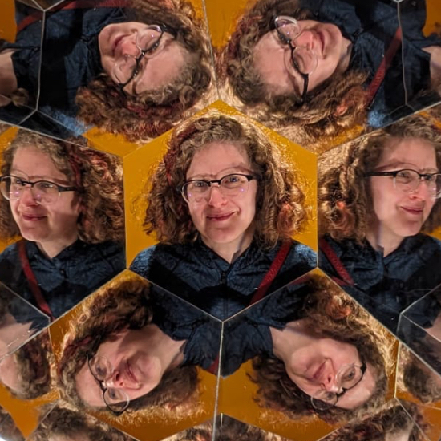

SIGGRAPH 2026
=============

.. raw:: html

    <h2 class='green'>Kaolin at SIGGRAPH 2026 — Los Angeles</h2>

    

        

            
Talk

            
<a href="#siggraph2026-talk">Interactive Web Framework</a>

            
Sun Jul 19 · 3:00–3:20 pm PDT

            
Room 408 A

            
<a href="https://s2026.conference-schedule.org/presentation/?id=gensub_229&sess=sess169">Official schedule</a>

        

        

            
Hands-on Lab

            
<a href="#siggraph2026-lab">Capture to Simulation</a>

            
Thu Jul 23 · 10:15–11:45 am PDT

            
Concourse Hall

            
<a href="https://s2026.conference-schedule.org/presentation/?id=gensub_123&sess=sess257">Official schedule</a>

        

    

Join us in **Los Angeles** for two SIGGRAPH 2026 sessions showcasing new Kaolin capabilities and latest 
research from NVIDIA Creative and Applied AI Tools group (CAAT) — a
**talk** on rapid prototyping of interactive Web tools over emerging AI and 3D research, and a
**hands-on lab** on an in-the-wild capture-to-simulation pipeline for 3D Gaussian Splat scenes.

.. raw:: html

    

      
<strong>Get notified:</strong> Most of the features highlighted here will ship in an upcoming Kaolin release.
      <a href="https://github.com/NVIDIAGameWorks/kaolin"><strong>Watch our GitHub repository</strong></a>
      and select <em>Custom → Releases</em> to be notified when it drops.

      

        
        
      

    

.. _siggraph2026 lab:

From 3D Captures to Simulated Digital Environments
--------------------------------------------------

.. raw:: html

    

      
Hands-on Lab

      
When Thursday, July 23rd, 2026 · 10:15–11:45 am PDT

      
Where Concourse Hall

      
Schedule <a href="https://s2026.conference-schedule.org/presentation/?id=gensub_123&sess=sess257">Hands-on Course</a>

      
Lecturers: <strong>Clement Fuji Tsang</strong>, <strong>Vismay Modi</strong>, <strong>Maria Shugrina</strong> (NVIDIA)

    

.. image:: ../../assets/sigg2026_lab.jpg
   :width: 100%

**Bring your laptop!** This hands-on course walks through a **capture-to-simulation pipeline** for in-the-wild
3D Gaussian Splat scenes. Attendees will segment objects, predict volumetric mechanical properties,
run physics simulation directly on Gaussian splats with a new version of Simplicits, and **export shareable USD files** with Kaolin's custom
physics schema — powered by recent Kaolin features and research:

* `ArtisanGS <https://research.nvidia.com/labs/sil/projects/ArtisanGS/>`_ — interactive Gaussian
  splat selection and segmentation (AI + human in the loop)
* `VoMP <https://research.nvidia.com/labs/sil/projects/vomp/>`_ — feed-forward prediction of
  volumetric mechanical property fields (Young's modulus, Poisson's ratio, density)
* `FreeForm / RKPM <https://research.nvidia.com/labs/sil/projects/freeform/>`_ — mesh-free
  reduced-order simulation integrated in Kaolin Simplicits (CVPR 2026)
* **Kaolin USD I/O** — export simulation-ready assets with Kaolin's custom physics material schema

.. _siggraph2026 lab content:

Content
~~~~~~~

.. rst-class:: wrap-table

.. list-table:: Approximate Lab Schedule
   :widths: 20 35 45
   :header-rows: 1

   * - Time
     - Topic
     - Supporting Materials
   * - 10:15–10:30 am
     - Introduction and environment setup, DLI, Lab overview.
     - `Kaolin Documentation <https://kaolin.readthedocs.io/en/latest/>`_
   * - 10:30–10:50 am
     - ArtisanGS overview. Load an in-the-wild 3D Gaussian Splat capture, and interactively segment objects in a 3DGS scene; save in USD (hands on).
     - `ArtisanGS <https://research.nvidia.com/labs/sil/projects/ArtisanGS/>`_, `pre-release app code <https://github.com/NVIDIAGameWorks/kaolin/tree/web_framework_prerelease/kaolin/app/segment>`_.
   * - 10:50–11:05 am
     - VoMP overview. Load splat segments, predict volumetric mechanical properties; save in USD (hands on).
     - `VoMP <https://research.nvidia.com/labs/sil/projects/vomp/>`_.
   * - 11:05–11:35 am
     - Simplicits/FreeForm overview. Multi-object Gaussian splat physics simulation using predicted properties; save in USD (hands on). Intro to newton coupling.
     - `FreeForm / RKPM <https://research.nvidia.com/labs/sil/projects/freeform/>`_, :ref:`Simplicits <physics_simulation>`, `Simplicits-newton <https://github.com/NVIDIAGameWorks/kaolin/tree/web_framework_prerelease/examples/tutorial/physics>`_ coupling, `newton <https://github.com/newton-physics/newton>`_.
   * - 11:35–11:45 am
     - Concluding remarks and Q&A.
     - —

The pipeline emphasizes **emerging research** and new Kaolin capabilities, including **custom USD schema** — mechanical properties, skinned physics,
and mixed representations are saved in easy-to-share USD files for easy collaboration.

.. _siggraph2026 lab run it yourself:

Run It Yourself
~~~~~~~~~~~~~~~

**Full lab resources will be available after the conference.**

For similar examples, see:

* :ref:`Physics simulation (Simplicits) <physics_simulation>`
* `GaussianSplatModel notebook <https://github.com/NVIDIAGameWorks/kaolin/blob/master/examples/tutorial/working_with_gaussians.ipynb>`_
* `Simulating Gaussian splats with Simplicits <https://github.com/NVIDIAGameWorks/kaolin/blob/master/examples/tutorial/physics/simplicits_gaussians_splatting.ipynb>`_
* `Mixed mesh-splat simulation and rendering with 3DGRUT <https://github.com/NVIDIAGameWorks/kaolin/blob/master/examples/tutorial/physics/simulatable_3dgrut.ipynb>`_
* `Simplicits-newton coupling examples <https://github.com/NVIDIAGameWorks/kaolin/tree/web_framework_prerelease/examples/tutorial/physics>`_

To try, install Kaolin from source, following :ref:`installation`.

**Companion research code**:

* `ArtisanGS <https://research.nvidia.com/labs/sil/projects/ArtisanGS/>`_, code coming soon and currently on `web_framework_prerelease branch <https://github.com/NVIDIAGameWorks/kaolin/tree/web_framework_prerelease>`_
* `VoMP <https://research.nvidia.com/labs/sil/projects/vomp/>`_, code and model available. 
* `FreeForm / RKPM <https://research.nvidia.com/labs/sil/projects/freeform/>`_, already on ``master``.

.. _siggraph2026 talk:

Accelerating Interactive Prototypes Over Cutting Edge AI & 3D Research
---------------------------------------------------------------------------

.. raw:: html

    

      
Talk

      
Session: Do it, Right Now!

      
When Sunday, July 19th, 2026 · 3:00–3:20 pm PDT (session 2:00–3:30 pm PDT)

      
Where Room 408 A

      
Schedule <a href="https://s2026.conference-schedule.org/presentation/?id=gensub_229&sess=sess169">Talk (Do it, Right Now!)</a>

      
Presenter: <strong>Maria Shugrina</strong> (NVIDIA / University of Toronto)

    

.. image:: ../../assets/web_framework.jpg
   :width: 100%

This talk introduces Kaolin's new **web client-server framework** (``kaolin/visualize/dash``) for
rapid prototyping of interactive browser interfaces over a large class of emerging technologies in
3D representations and AI. The design encapsulates patterns distilled from building many interactive
tool prototypes presented at SIGGRAPH technical papers, Real-Time Live, and Labs — supporting
flexible research workflows that combine user interaction with cutting-edge AI and 3D tooling.

.. note::

   🌱 This toolkit is young and evolving, so use it with caution. Our target is rapid
   research prototype development on a secure internal network, and not production deployment.

The framework is **not yet on** ``master``; it lives on the public
`web_framework_prerelease branch <https://github.com/NVIDIAGameWorks/kaolin/tree/web_framework_prerelease>`_.
See documentation (👈 **start with** ``kaolin.visualize`` for the
high-level Python API, examples, and tutorials; the JavaScript API covers the browser-side
``window.kaolin`` utilities):

.. raw:: html

    

      
      
      
    

.. _siggraph2026 talk attend:

.. _siggraph2026 talk content:

Content
~~~~~~~

.. rst-class:: wrap-table

.. list-table:: Approximate Talk Outline
   :widths: 20 35 45
   :header-rows: 1

   * - Time
     - Topic
     - Supporting Materials
   * - 3:00–3:08 pm
     - Motivation: interactive prototypes over AI & 3D research
     - Findings from prior CAAT interactive tools at SIGGRAPH (technical papers, RTL, Labs)
   * - 3:08–3:15 pm
     - Web client-server architecture in Kaolin
     - ``kaolin/visualize/dash`` overview; `branch <https://github.com/NVIDIAGameWorks/kaolin/tree/web_framework_prerelease>`_
   * - 3:15–3:18 pm
     - Example applications on the branch
     - See :ref:`sample apps <siggraph2026 talk apps>` below
   * - 3:18–3:20 pm
     - Q & A
     - —

.. _siggraph2026 talk apps:

Sample applications (``web_framework_prerelease`` branch)
~~~~~~~~~~~~~~~~~~~~~~~~~~~~~~~~~~~~~~~~~~~~~~~~~~~~~~~~~

Example client-server apps built with the framework:

* `Gaussian Splat Segmentation <https://github.com/NVIDIAGameWorks/kaolin/tree/web_framework_prerelease/kaolin/app/segment>`_ —
  interactive 2D/3D selection and SAM2-based segmentation of Gaussian splats
  (`segment app README <https://github.com/NVIDIAGameWorks/kaolin/blob/web_framework_prerelease/kaolin/app/segment/README.md>`_)
* `Toy Gaussian Splat Inpainter <https://github.com/NVIDIAGameWorks/kaolin/tree/web_framework_prerelease/kaolin/app/splat_inpaint>`_ —
  server-side splat rendering with 2D diffusion inpainting baked back into the 3D scene
  (`inpaint app README <https://github.com/NVIDIAGameWorks/kaolin/blob/web_framework_prerelease/kaolin/app/splat_inpaint/README.md>`_)

.. _siggraph2026 talk run it yourself:

Run It Yourself
~~~~~~~~~~~~~~~

#. Check out the `web_framework_prerelease <https://github.com/NVIDIAGameWorks/kaolin/tree/web_framework_prerelease>`_ branch.
#. Build Kaolin from source following :ref:`installation` (Python >= 3.11, Node.js required for the web components).
#. Explore the sample apps under ``kaolin/app/`` (see :ref:`sample apps <siggraph2026 talk apps>`).
#. *TBD:* step-by-step setup notebook and launch instructions.

.. _siggraph2026 organizers:

Organizers
----------

.. raw:: html

    

        
        

            <h3>Clement Fuji Tsang</h3>
            
Clement is a Senior Research Scientist at NVIDIA, leading Kaolin Library development
             and working on Deep Learning applied to 3D and computer vision. Previously Clement was working on operators
            fusion and TensorRT integration in MXNet, as well as large scale training of Deep Learning models.
            His current focus is to develop and share Deep Learning solutions that are efficient and scalable on GPUs for 3D,
            computer vision and NLP tasks. He has been presenting Kaolin at SIGGRAPH 2022, 2024, and multiple GTCs.

        

    

    

        
        

            <h3>Vismay Modi</h3>
            
Vismay is a Research Scientist at NVIDIA, working on Kaolin's representation-agnostic physics simulator.
            His focus is to enable interactive simulation of 3D objects in various representations, empowering artists,
            researchers and engineers to easily prototype, animate and simulate their generated or reconstructed 3D assets.
            His research goal is to ensure that simulation tools support a diverse set of interactive physics-based phenomena,
            including elasto-dynamics, muscle activation, joints, cloth, collisions with frictional contact, on any 3D representation,
            including NeRFs, 3D Gaussian splats, CT scans and more.

        

    

    

        
        

            <h3>Masha (Maria) Shugrina</h3>
            
Masha is a Senior Research Scientist at NVIDIA and leader of the Creative and Applied AI Tools group (CAAT), which focuses on
            interactive applications of AI and on efforts to accelerate research, including the NVIDIA Kaolin Library.
            Her core research interest is advancing techniques that integrate AI and latest technologies into the interactive loop.
            She defended her PhD at the University of Toronto, and Master’s at MIT. She has also worked as a Research Engineer at Adobe
            and Senior Software Engineer and Tech Lead at Google.

        

    

