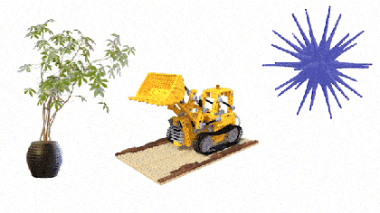

Physics Simulation for Points, Meshes, Splats and more
******************************************************

.. _physics_simulation:

.. raw:: html

   

   Simulating 3D Gaussian Splats, point clouds and meshes directly, without any geometric preprocessing.
   

Traditionally, physics simulation algorithms operate on carefully curated volumetric 3D representations.
While Kaolin supports :ref:`Several Methods <volumetric_meshes>` for construction of volumetric meshes, this
can introduce unnecessary complexity between 3D content and ability to simulate it. With Kaolin v0.16.0,
we introduce :py:mod:`kaolin.physics` module and integrate state-of-the art Simplicits method in :py:mod:`kaolin.physics.simplicits`
that allows **running physics simulation on any point-sampled geometry, such as point clouds, meshes, as well as 3D Gaussian splats**
(`see here <https://repo-sam.inria.fr/fungraph/3d-gaussian-splatting/>`_) and more.

The original publication for this method is: `"Simplicits: Mesh-Free, Geometry-Agnostic Elastic Simulation." <https://research.nvidia.com/labs/toronto-ai/simplicits/>`_
Modi, Vismay, Nicholas Sharp, Or Perel, Shinjiro Sueda, and David IW Levin. SIGGRAPH (TOG) 2024.

Examples and Tutorials
======================

See example notebooks under `examples/tutorial/physics <https://github.com/NVIDIAGameWorks/kaolin/tree/master/examples/tutorial/physics>`_, including the following.

Easy Physics Simulation
^^^^^^^^^^^^^^^^^^^^^^^

Notebook: `examples/tutorial/physics/simplicits_easy_api.ipynb <https://github.com/NVIDIAGameWorks/kaolin/blob/master/examples/tutorial/physics/simplicits_easy_api.ipynb>`_.

Set up and view a physics simulation in a jupyter notebook in just a few lines of code.

Interactive Physics Simulation
^^^^^^^^^^^^^^^^^^^^^^^^^^^^^^

Notebook: `examples/tutorial/physics/simplicits_interactive.ipynb <https://github.com/NVIDIAGameWorks/kaolin/blob/master/examples/tutorial/physics/simplicits_interactive.ipynb>`_.

Add interactive physics with mouse interaction directly in a  Jupyter Notebook, leveraging :ref:`Kaolin Jupyter 3D Viewer <visualizer>`.

Low-Level Physics Utilities
^^^^^^^^^^^^^^^^^^^^^^^^^^^

Notebook: `examples/tutorial/physics/simplicits_low_level_api.ipynb <https://github.com/NVIDIAGameWorks/kaolin/blob/master/examples/tutorial/physics/simplicits_low_level_api.ipynb>`_.

Look under the hood at the low-level :py:mod:`kaolin.physics` utilities, including energy functions and unwrapped simulation loops.

Simplicits Background
=====================

Refer to `original publication <https://research.nvidia.com/labs/toronto-ai/simplicits/>`_ for details.
Briefly, to enable representation-agnostic simulation, Simplicits method first samples any input geometry:

Next, the method runs training to learn dominant degress of freedom for this object:

Finally, many interactive simulations can be run in the reduced space, with convenience method returning
translations of any original location on the original geometric shape:
