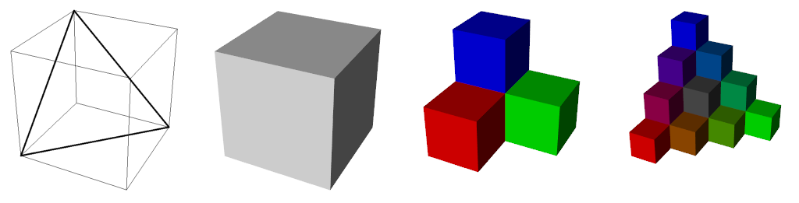
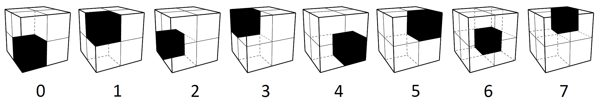
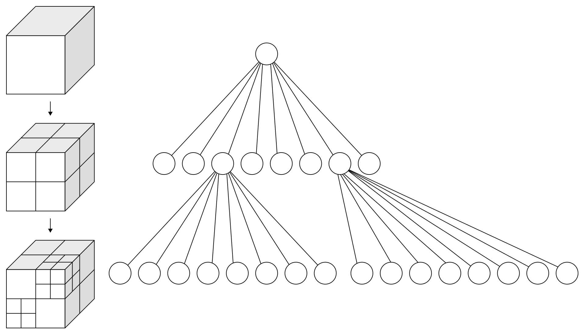
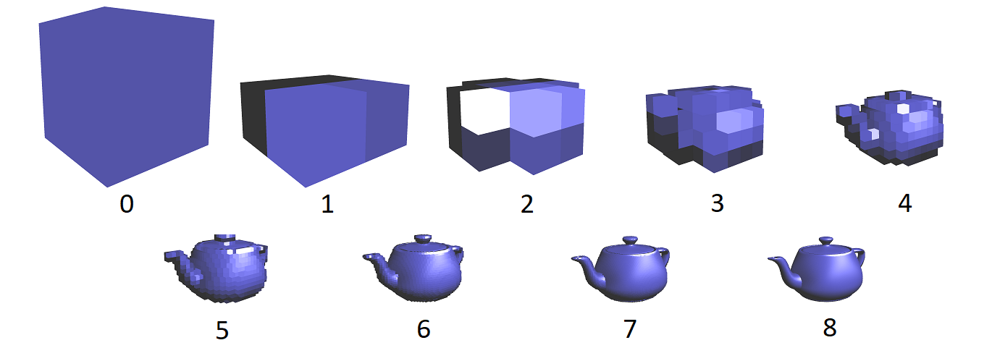
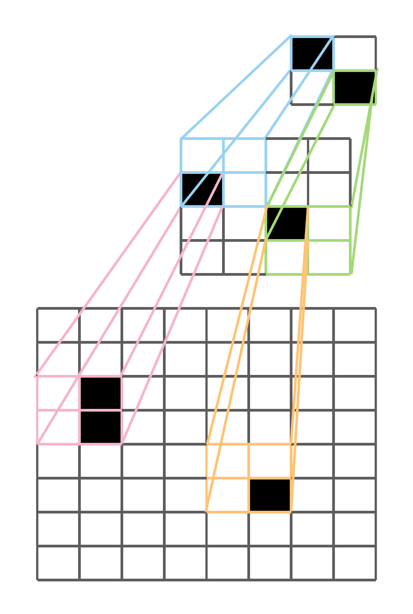

Structured Point Clouds (SPCs)
******************************

.. _spc:

Structured Point Clouds (SPC) is a sparse octree-based representation that is useful to organize and 
compress 3D geometrically sparse information. 
They are also known as sparse voxelgrids, quantized point clouds, and voxelized point clouds. 

Kaolin supports a number of operations to work with SPCs, 
including efficient ray-tracing and convolutions.

The SPC data structure is very general. In the SPC data structure, octrees provide a way to store and efficiently retrieve coordinates of points at different levels of the octree hierarchy. It is also possible to associate features to these coordinates using point ordering in memory. Below we detail the low-level representations that comprise SPCs and allow corresponding efficient operations. We also provide a :ref:`convenience container<kaolin.rep>` for these low-level attributes.

Some of the conventions are also defined in `Neural Geometric Level of Detail: Real-time Rendering with
Implicit 3D Surfaces <https://nv-tlabs.github.io/nglod/>`_ which uses SPC as an internal representation.

.. warning::
  Structured Point Clouds internal layout and structure is still experimental and may be modified in the future.

Octree
======

.. _spc_octree:

Core to SPC is the  `octree <https://en.wikipedia.org/wiki/Octree>`_, a tree data 
structure where each node have up to 8 childrens.
We use this structure to do a recursive three-dimensional space partitioning, 
i.e: each node represents a partitioning of its 3D space (partition) of :math:`(2, 2, 2)`.
The octree then contains the information necessary to find the sparse coordinates.

In SPC, a batch of octrees is represented as a tensor of bytes. Each bit in the byte array ``octrees`` represents
the binary occupancy of an octree bit sorted in `Morton Order <https://en.wikipedia.org/wiki/Z-order_curve>`_. 
The Morton order is a type of space-filling curve which gives a deterministic ordering of 
integer coordinates on a 3D grid. That is, for a given non-negative 1D integer coordinate, there exists a 
bijective mapping to 3D integer coordinates.

Since a byte is a collection of 8 bits, a single byte ``octrees[i]``
represents an octree node where each bit indicate the binary occupancy of a child node / partition as 
depicted below:

For each octree, the nodes / bytes are following breadth-first-search order (with Morton order for
childrens order), and the octree bytes are then :ref:`packed` to form ``octrees``. This ordering
allows efficient tree access without having to explicilty store indirection pointers.

  Credit: https://en.wikipedia.org/wiki/Octree

The binary occupancy values in the bits of ``octrees`` implicitly encode position data due to the bijective
mapping from Morton codes to 3D integer coordinates. However, to provide users a more straight 
forward interface to work with these octrees, SPC provides auxilary information such as  
``points`` which is a :ref:`packed` tensor of 3D coordinates. Refer to the :ref:`spc_attributes` section
for more details.

Currently SPCs are primarily used to represent 3D surfaces, 
and so all the leaves are at the same ``level`` (depth). 
This allow very efficient processing on GPU, with custom CUDA kernels, for ray-tracing and convolution.

The structure contains finer details as you go deeper in to the tree. 
Below are the Levels 0 through 8 of a SPC teapot model:

Additional Feature Data
=======================

The nodes of the ``octrees`` can contain information beyond just the 3D coordinates of the nodes,
such as RGB color, normals, feature maps, or even differentiable activation maps processed by a 
convolution.

We follow a `Structure of Arrays <https://en.wikipedia.org/wiki/AoS_and_SoA>`_ approach to store 
additional data for maximum user extensibility.
Currently the features would be tensors of shape :math:`(\text{num_nodes}, \text{feature_dim})`
with ``num_nodes`` being the number of nodes at a specific ``level`` of the ``octrees``,
and ``feature_dim`` the dimension of the feature set (for instance 3 for RGB color).
Users can freely define their own feature data to be stored alongside SPC.

Conversions
===========

Structured point clouds can be derived from multiple sources.

We can construct ``octrees``
from unstructured point cloud data, from sparse voxelgrids 
or from the level set of an implicit function :math:`f(x, y, z)`. 

.. _spc_attributes:

Related attributes
==================

.. note::
  If you just wanna use the structured point clouds without having to go through the low level details, take a look at :ref:`the high level classes <kaolin.rep>`.

.. _spc_lengths:

``lengths:``
------------

Since ``octrees`` use :ref:`packed` batching, we need ``lengths`` a 1D tensor of size ``batch_size`` that contains the size of each individual octree. Note that ``lengths.sum()`` should equal the size of ``octrees``. You can use :func:`kaolin.ops.batch.list_to_packed` to pack octrees and generate ``lengths``

.. _spc_pyramids:

``pyramids:``
-------------

:class:`torch.IntTensor` of shape :math:`(\text{batch_size}, 2, \text{max_level} + 2)`. Contains layout information for each octree ``pyramids[:, 0]`` represent the number of points in each level of the ``octrees``, ``pyramids[:, 1]`` represent the starting index of each level of the octree.

.. _spc_exsum:

``exsum:``
----------

:class:`torch.IntTensor` of shape :math:`(\text{octrees_num_bytes} + \text{batch_size})` is the exclusive sum of the bit counts of each ``octrees`` byte.

.. note::
  To generate ``pyramids`` and ``exsum`` see :func:`kaolin.ops.spc.scan_octrees`

.. _spc_points:

``point_hierarchies:``
----------------------

:class:`torch.ShortTensor` of shape :math:`(\text{num_nodes}, 3)` correspond to the sparse coordinates at all levels. We refer to this :ref:`packed` tensor as the **structured point hierarchies**.

The image below show an analogous 2D example.

the corresponding ``point_hierarchies`` would be:

>>> torch.ShortTensor([[0, 0], [1, 1],
                       [1, 0], [2, 2],
                       [2, 1], [3, 1], [5, 5]
                      ])

.. note::
  To generate ``points`` see :func:`kaolin.ops.generate_points`

.. note::
  the tensors ``pyramid``, ``exsum`` and ``points`` are used by many Structured Point Cloud functions; avoiding their recomputation will improve performace.

Convolutions
============

We provide several sparse convolution layers for structured point clouds.
Convolutions are characterized by the size of the input and output channels, 
an array of ``kernel_vectors``, and possibly the number of levels to ``jump``, i.e.,
the difference in input and output levels. 

.. _kernel-text:

An example of how to create a :math:`3 \times 3 \times 3` kernel follows:

>>> vectors = []
>>> for i in range(-1, 2):
>>>     for j in range(-1, 2):
>>>         for k in range(-1, 2):
>>>             vectors.append([i, j, k])
>>> Kvec = torch.tensor(vectors, dtype=torch.short, device=device)
>>> Kvec
tensor([[-1, -1, -1],
        [-1, -1,  0],
        [-1, -1,  1],
        ...
        ...
        [ 1,  1, -1],
        [ 1,  1,  0],
        [ 1,  1,  1]], device='cuda:0', dtype=torch.int16)

.. _neighborhood-text:

The kernel vectors determine the shape of the convolution kernel. 
Each kernel vector is added to the position of a point to determine
the coordinates of points whose corresponding input data is needed for the operation. 
We formalize this notion using the following neighbor function:

.. math::

  n(i,k) = \text{ID}\left(P_i+\overrightarrow{K}_k\right)

that returns the index of the point within the same level found by adding 
kernel vector :math:`\overrightarrow{K}_k` to point :math:`P_i`. 
Given the sparse nature of SPC data, it may be the case that no such point exists. In such cases, :math:`n(i,k)`
will return an invalid value, and data accesses will be treated like zero padding.

Transposed convolutions are defined by the transposed neighbor function

.. math::

  n^T(i,k) = \text{ID}\left(P_i-\overrightarrow{K}_k\right)

The value **jump** is used to indicate the difference in levels between the iput features
and the output features. For convolutions, this is the number of levels to downsample; while
for transposed convolutions, **jump** is the number of levels to upsample. The value of **jump** must
be positive, and may not go beyond the highest level of the octree.

Examples
--------

You can create octrees from sparse feature_grids
(of shape :math:`(\text{batch_size}, \text{feature_dim}, \text{height}, \text{width}, \text{depth})`):

>>> octrees, lengths, features = kaolin.ops.spc.feature_grids_to_spc(features_grids)

or from point cloud (of shape :math:`(\text{num_points, 3})`):

>>> qpc = kaolin.ops.spc.quantize_points(pc, level)
>>> octree = kaolin.ops.spc.unbatched_points_to_octree(qpc, level)

To use convolution, you can use the functional or the torch.nn.Module version like torch.nn.functional.conv3d and torch.nn.Conv3d:

>>> max_level, pyramids, exsum = kaolin.ops.spc.scan_octrees(octrees, lengths)
>>> point_hierarchies = kaolin.ops.spc.generate_points(octrees, pyramids, exsum)
>>> kernel_vectors = torch.tensor([[0, 0, 0], [0, 0, 1], [0, 1, 0], [0, 1, 1],
                                   [1, 0, 0], [1, 0, 1], [1, 1, 0], [1, 1, 1]],
                                  dtype=torch.ShortTensor, device='cuda')
>>> conv = kaolin.ops.spc.Conv3d(in_channels, out_channels, kernel_vectors, jump=1, bias=True).cuda()
>>> # With functional
>>> out_features, out_level = kaolin.ops.spc.conv3d(octrees, point_hierarchies, level, pyramids,
...                                                 exsum, coalescent_features, weight,
...                                                 kernel_vectors, jump, bias)
>>> # With nn.Module and container class
>>> input_spc = kaolin.rep.Spc(octrees, lengths)
>>> conv 
>>> out_features, out_level = kaolin.ops.spc.conv_transpose3d(
...     **input_spc.to_dict(), input=out_features, level=level,
...     weight=weight, kernel_vectors=kernel_vectors, jump=jump, bias=bias)

To apply ray tracing we currently only support non-batched version, for instance here with RGB values as per point features:

>>> max_level, pyramids, exsum = kaolin.ops.spc.scan_octrees(
...     octree, torch.tensor([len(octree)], dtype=torch.int32, device='cuda')
>>> point_hierarchy = kaolin.ops.spc.generate_points(octrees, pyramids, exsum)
>>> ridx, pidx, depth = kaolin.render.spc.unbatched_raytrace(octree, point_hierarchy, pyramids[0], exsum,
...                                                          origin, direction, max_level)
>>> first_hits_mask = kaolin.render.spc.mark_pack_boundaries(ridx)
>>> first_hits_point = pidx[first_hits_mask]
>>> first_hits_rgb = rgb[first_hits_point - pyramids[max_level - 2]]

Going further with SPC:
=======================

Examples:
----------------------------

See our Jupyter notebook for a walk-through of SPC features:

`examples/tutorial/understanding_spcs_tutorial.ipynb <https://github.com/NVIDIAGameWorks/kaolin/blob/master/examples/tutorial/understanding_spcs_tutorial.ipynb>`_

And also our recipes for simple examples of how to use SPC:

    * `spc_basics.py <https://github.com/NVIDIAGameWorks/kaolin/blob/master/examples/recipes/spc/spc_basics.py>`_: showing attributes of an SPC object
    * `spc_dual_octree.py <https://github.com/NVIDIAGameWorks/kaolin/blob/master/examples/recipes/spc/spc_dual_octree.py>`_: computing and explaining the dual of an SPC octree
    * `spc_trilinear_interp.py <https://github.com/NVIDIAGameWorks/kaolin/blob/master/examples/recipes/spc/spc_trilinear_interp.py>`_: computing trilinear interpolation of a point cloud on an SPC

SPC Documentation:
------------------

Functions useful for working with SPCs are available in the following modules:

* :ref:`kaolin.ops.spc<kaolin.ops.spc>` - general explanation and operations
* :ref:`kaolin.render.spc<kaolin.render.spc>` - rendering utilities
* :class:`kaolin.rep.Spc` - high-level wrapper

