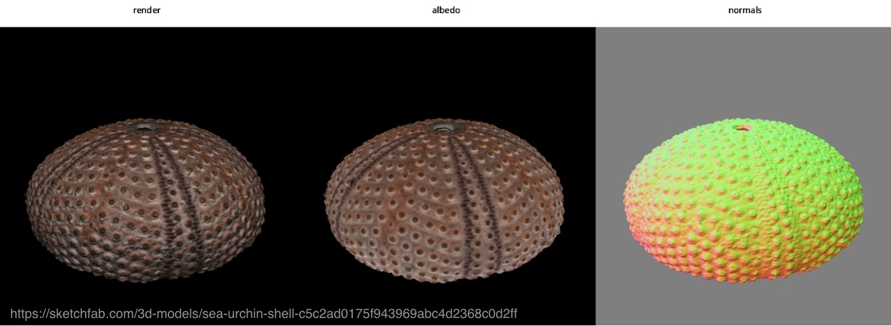

Working with Surface Meshes
***************************

.. _surface_meshes:

Polygonal surface meshes are a common 3D representation, with subtle differences in the treatment of attributes like normals and uvmaps across formats. Since v0.15.0, Kaolin has tried to simplify and standardize the process of working with polygonal surface meshes in PyTorch.

Importing and Managing Meshes in PyTorch
========================================

With v0.16.0, we have introduced a consistent import function :any:`kaolin.io.mesh.import_mesh` that imports geometry, normals and materials using the same conventions for ``.obj``, ``.gltf``, ``.glb``, and ``.USD`` file formats. This importer outputs a convenient :class:`kaolin.rep.SurfaceMesh` class that simplifies working with both single and batched meshes and their many attributes, including normals, uvmaps, vertex and face features, all represented as PyTorch tensors.

See **Working With Meshes Tutorial Notebook** at `examples/tutorial/working_with_meshes.ipynb <https://github.com/NVIDIAGameWorks/kaolin/blob/master/examples/tutorial/working_with_meshes.ipynb>`_ also explained below:

.. raw:: html

    <iframe width="560" height="315" src="https://www.youtube.com/embed/sRAgqNhsfJA?si=IZMXoSnjVobJ7Loh" title="YouTube video player" frameborder="0" allow="accelerometer; autoplay; clipboard-write; encrypted-media; gyroscope; picture-in-picture; web-share" referrerpolicy="strict-origin-when-cross-origin" allowfullscreen></iframe>
    

Mesh Operations
===============

Kaolin Library philosophy is not to rely on opaque storage containers as inputs to basic operations, but rather
take plain PyTorch tensors as arguments. As the result most mesh operations do not take :class:`kaolin.rep.SurfaceMesh` as input,
but its tensor attributes. For mesh-related opartions see:

* :py:mod:`kaolin.ops.mesh` - general operations on meshes
* :py:mod:`kaolin.metrics.mesh` - operations related to metrics
* :py:mod:`kaolin.io` - individual importers for ``.obj``, ``.gltf``, ``.glb``, and ``.USD`` file formats, and also support for cached datasets like ShapeNet and others.
* :py:mod:`kaolin.render.mesh` - low-level differentiable rendering operations on meshes

Rendering
=========

With v0.16.0 we have also introduced an easy and consistent way to render PyTorch meshes imported from
``.obj``, ``.gltf``, ``.glb``, and ``.USD`` using :any:`kaolin.render.easy_render.render_mesh` method.
See **Mesh Easy Render Tutorial Notebook** at `examples/tutorial/easy_mesh_render.ipynb <https://github.com/NVIDIAGameWorks/kaolin/blob/master/examples/tutorial/easy_mesh_render.ipynb>`_.

For example, here we render different passes of an in-the-wild `Sea Urchin Shell <https://sketchfab.com/models/c5c2ad0175f943969abc4d2368c0d2ff/embed>`_ GLTF mesh by `Drakery <https://sketchfab.com/drakery>`_, purchased on `Sketchfab <https://www.sketchfab.com/>`_.
