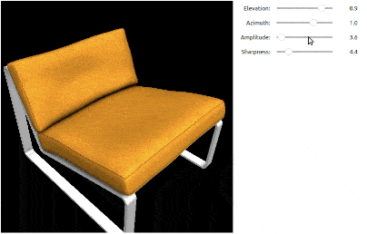

Interactive Jupyter 3D Viewer
*****************************

.. _visualizer:

.. raw:: html

   <video width="456" height="360" autoplay="true" loop="true" controls>
   <source src="../_static/visualizer_urchin.mp4" type="video/mp4">
   </video>
   

   Interactively view/debug the output of any custom render function in a Jupyter notebook  
   (here showing differentiable rendering of a <a src="https://sketchfab.com/models/c5c2ad0175f943969abc4d2368c0d2ff/embed">Sea Urchin Shell</a> by <a href="https://sketchfab.com/drakery">Drakery</a> from <a href="https://www.sketchfab.com/">Sketchfab</a>).
   

From differentiable renderers to NERFs, 3D Deep Learning, AI and Computer Vision research is abundant with custom rendering
functions. For many examples, the output of the learning or reconstruction pipeline is a novel 3D representation
that can only be viewed by executing custom rendering code. Often this code
involves inference network execution or is written as a CUDA kernel accessible from python, e.g. through PyTorch interface.
Some examples include `3D Gaussian Splats <https://repo-sam.inria.fr/fungraph/3d-gaussian-splatting/>`_,
or NERF variants and generative Tri-Planes below:

.. raw:: html

   

         a) <a href="https://research.nvidia.com/labs/toronto-ai/adaptive-shells/"">Adaptive Shells</a>, Wang et al.
         b) <a href="https://research.nvidia.com/labs/toronto-ai/GET3D/">Get3D</a>, Gao et al.
         c) <a href="https://nvlabs.github.io/instant-ngp/">INGP</a>, Müller et al.
   

To showcase results of novel 3D representations, many papers present turn-around renderings using their custom rendering code,
but it can be difficult to judge true quality without the option to inspect 3D objects and scenes interactively. It can also be
quite difficult to debug custom rendering functions without this ability, as custom scripts need to be written for controlling
the camera.

To make novel 3D representations more inspectable and interactive during early research and debugging, Kaolin Library
provides in interactive 3D viewer for Jupyter notebooks, that can be easily configured to show the output of *any custom rendering function*.
The camera can be controlled by the mouse directly in the Jupyter cell output, allowing easy interactive inspection and debugging.

See :any:`kaolin.visualize.IpyTurntableVisualizer` and :any:`kaolin.visualize.IpyFirstPersonVisualizer`, which take a rendering
function that takes :class:`kaolin.render.camera.Camera` as input (the only requirement).

Examples and Tutorials
======================

There is a lot you can do with interactive visualizer, including prototyping interactive interfaces using html5 elements.
These tutorials are only meant to get you started.

Interactive Visualizer Tutorial
^^^^^^^^^^^^^^^^^^^^^^^^^^^^^^^

Notebook: `examples/tutorial/interactive_visualizer.ipynb <https://github.com/NVIDIAGameWorks/kaolin/blob/master/examples/tutorial/interactive_visualizer.ipynb>`_.

See our main tutorial on interactive visualizer, including configuring and adding other widgets and additional canvas elements.

Interactive Differentiable Rendering of GLTF files
^^^^^^^^^^^^^^^^^^^^^^^^^^^^^^^^^^^^^^^^^^^^^^^^^^

Notebook: `examples/tutorial/gltf_viz.ipynb <https://github.com/NVIDIAGameWorks/kaolin/blob/master/examples/tutorial/gltf_viz.ipynb>`_.

View interactive rendering of GTLF files, complete with sliders varying differentiable Spherical Gaussian lighting (see :ref:`Differentiable Lighting <differentiable_lighting>`).

FlexiCubes Custom Rendering Function
^^^^^^^^^^^^^^^^^^^^^^^^^^^^^^^^^^^^

Notebook: `optimization.ipynb in the flexicubes repository <https://github.com/nv-tlabs/FlexiCubes/blob/main/examples/optimization.ipynb>`_.

.. raw:: html

   <video width="440" height="240" autoplay="true" loop="true" controls>
   <source src="../_static/flexi_mess.mp4" type="video/mp4">
   </video>

See interactive visualizer used in a research projects to visualize a custom rendering function for :ref:`FlexiCubes <flexi_cubes>`.

Vieweing Gaussian Splats in a Jupyter Notebook
^^^^^^^^^^^^^^^^^^^^^^^^^^^^^^^^^^^^^^^^^^^^^^

Here is also an unofficial walk-though of how to use interactive visualizer with
`3D Gaussian Splats <https://repo-sam.inria.fr/fungraph/3d-gaussian-splatting/>`_:

.. raw:: html

   <iframe width="560" height="315" src="https://www.youtube.com/embed/OcvA7fmiZYM?si=gyWIe50Cvcn2b5-M" title="YouTube video player" frameborder="0" allow="accelerometer; autoplay; clipboard-write; encrypted-media; gyroscope; picture-in-picture; web-share" referrerpolicy="strict-origin-when-cross-origin" allowfullscreen></iframe>
