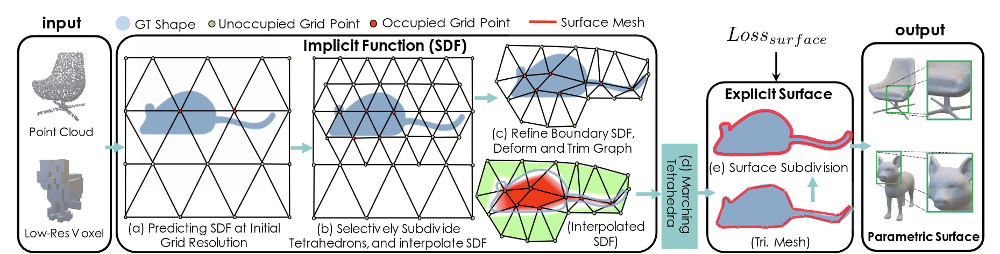
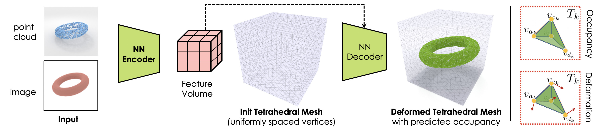

Volumetric Mesh Optimization
****************************

.. _volumetric_meshes:

Kaolin Library integrates research modules for volumetric mesh optimization, including
:ref:`DefTet <deftet>`, :ref:`DMTet <dmtet>` and :ref:`FlexiCubes <flexi_cubes>`. These modules can be used for one-off optimization or become
differentiable modules in AI workflows.

For docs related to tetrahedral meshes, see :py:mod:`kaolin.ops.mesh` and :py:mod:`kaolin.metrics.tetmesh`, as well as dedicated modules linked below such as :any:`kaolin.render.mesh.deftet_sparse_render` and :any:`kaolin.ops.conversions.FlexiCubes`.

.. _flexi_cubes:

FlexiCubes
==========

.. raw:: html

   <iframe width="560" height="315" src="https://www.youtube.com/embed/2gqdsUHBhEI?si=U65O1sOV9EDb4Ofi" title="YouTube video player" frameborder="0" allow="accelerometer; autoplay; clipboard-write; encrypted-media; gyroscope; picture-in-picture; web-share" referrerpolicy="strict-origin-when-cross-origin" allowfullscreen></iframe>

The original publication for this method is: `"Flexible Isosurface Extraction for Gradient-Based Mesh Optimization." <https://research.nvidia.com/labs/toronto-ai/flexicubes/>`_ Shen, Tianchang, Jacob Munkberg, Jon Hasselgren, Kangxue Yin, Zian Wang, Wenzheng Chen, Zan Gojcic, Sanja Fidler, Nicholas Sharp, and Jun Gao.  SIGGRAPH (TOG) 2023.

Kaolin ships :class:`kaolin.ops.conversions.FlexiCubes` module, the official maintained version of the FlexiCubes
academic paper.

See **Kaolin FlexiCubes Tutorial** in `the original flexicubes repository <https://github.com/nv-tlabs/FlexiCubes/blob/main/examples/optimization.ipynb>`_, with a walk through video above.

.. _dmtet:

Deep Marching Tetrahedra (DMTet)
================================

The original publication for this method is: `"Deep marching tetrahedra: a hybrid representation for high-resolution 3d shape synthesis." <https://research.nvidia.com/labs/toronto-ai/DMTet/>`_ Shen, Tianchang, Jun Gao, Kangxue Yin, Ming-Yu Liu, and Sanja Fidler. NeurIPS 2021.

Kaolin integrates :any:`kaolin.ops.conversions.marching_tetrahedra` from this research, and has more general functionality related to this work, such as :any:`kaolin.metrics.pointcloud.chamfer_distance`.

See **Deep Marching Tetrahedra Tutorial** `examples/tutorial/dmtet_tutorial.ipynb <https://github.com/NVIDIAGameWorks/kaolin/blob/master/examples/tutorial/dmtet_tutorial.ipynb>`_ which trains an SDF estimator to reconstruct a tetrahedral mesh from a point cloud.

.. _deftet:

DefTet
======

The original publication for this method is: `"Learning deformable tetrahedral meshes for 3d reconstruction." <https://research.nvidia.com/labs/toronto-ai/DefTet/>`_ Gao, Jun, Wenzheng Chen, Tommy Xiang, Alec Jacobson, Morgan McGuire, and Sanja Fidler. NeurIPS 2020.

Kaolin provides the DefTet volumetric renderer, developed in this work, as :any:`kaolin.render.mesh.deftet_sparse_render`, and also the loss function :any:`kaolin.metrics.tetmesh.equivolume`.
