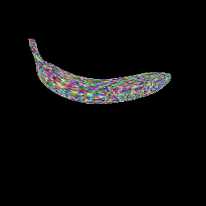

# DIB-Renderer Example



This example uses the DIB-R renderer in kaolin to render a simple mesh (using random vertex colors), and output an animated GIF image of the rendered object.

Usage:

```bash
python example.py
```

By default, the example will render the `banana.obj` mesh in this directory, and output the result into a `results` folder in this directory.

Use the `--help` option to display available arguments.

The DIB-R renderer is based on its original implementation by Wenzheng et al.

```
@inproceedings{chen2019dibrender,
title={Learning to Predict 3D Objects with an Interpolation-based Differentiable Renderer},
author={Wenzheng Chen and Jun Gao and Huan Ling and Edward Smith and Jaakko Lehtinen and Alec Jacobson and Sanja Fidler},
booktitle={Advances In Neural Information Processing Systems},
year={2019}
}
```
