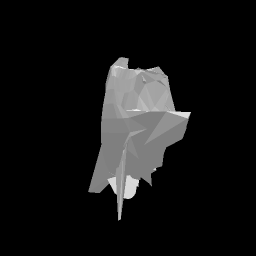
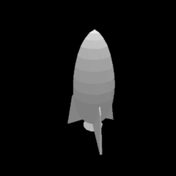

# Neural Mesh Renderer (NMR) Examples


These examples make use of the Neural Mesh Renderer in kaolin to render meshes and perform optimizations.

Each of these examples will, by default, operate on the `rocket.obj` (and some of the PNG images) in this directory, and output animated GIF images to a `results` folder (which will be created if not exist).

To run each example, simply execute `python <example-script>`, where `<example-script>` is one of the four examples in this directory.

To see the command line arguments of each example, run `python <example-script> --help`.

## Example 1

Renders the mesh from multiple viewpoints.

Example output:


## Example 2

Transforming the silhouette of the mesh to match the target image (a square by default), by optimizing the vertices.

Example target image, final mesh, and optimization process:





## Example 3

Transforming the color of the mesh to match a target image, by optimizing the texture.

Example target image, final mesh, and optimization process:


## Example 4

Transform the camera position to match a target image, by optimizing it directly.

Example target image and final mesh:




## Citation

The Neural Mesh Renderer and the examples are based on its original implementation by Kato et al.

```
@InProceedings{kato2018renderer
    title={Neural 3D Mesh Renderer},
    author={Kato, Hiroharu and Ushiku, Yoshitaka and Harada, Tatsuya},
    booktitle={The IEEE Conference on Computer Vision and Pattern Recognition (CVPR)},
    year={2018}
}
```
