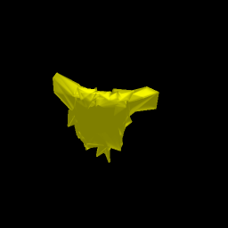

# Differentiable renderers

This set of examples demonstrates how implementations of popular differentiable renderers:

1. Neural Mesh Renderer
2. Soft Rasterizer
3. DIB-Renderer

We thank the authors of the above papers for making their code publicly available. If you use any part of the code from the respective folders, consider citing the authors' original publications:

Neural mesh renderer
```
@InProceedings{kato2018renderer
    title={Neural 3D Mesh Renderer},
    author={Kato, Hiroharu and Ushiku, Yoshitaka and Harada, Tatsuya},
    booktitle={The IEEE Conference on Computer Vision and Pattern Recognition (CVPR)},
    year={2018}
}
```

Soft Rasterizer
```
@article{liu2019softras,
  title={Soft Rasterizer: A Differentiable Renderer for Image-based 3D Reasoning},
  author={Liu, Shichen and Li, Tianye and Chen, Weikai and Li, Hao},
  journal={The IEEE International Conference on Computer Vision (ICCV)},
  month = {Oct},
  year={2019}
}
```

DIB-Renderer
```
@inproceedings{chen2019dibrender,
  title={Learning to Predict 3D Objects with an Interpolation-based Differentiable Renderer},
  author={Wenzheng Chen and Jun Gao and Huan Ling and Edward Smith and Jaakko Lehtinen and Alec Jacobson and Sanja Fidler},
  booktitle={Advances In Neural Information Processing Systems},
  year={2019}
}
```


## Soft Rasterizer (softras)

This popular renderer is based on the 2019 ICCV paper by Schichen Liu, Tianye Li, Weikai Chen, and Hao Li. Softras is a differentiable _rasterization-based_ renderer that can provide gradient with respect to the vertex positions and texture (color) of a Mesh. The following examples demonstrate a typical use cases, and can be repurposed to suit your needs.

### Example 1: Simple rendering

The [`softras_simple_render`](softras_simple_render.py) script provides a breezy intro to the renderer API. To run this example, execute the following command

```bash
python softras_simple_render.py
```

This should render a _banana_ from multiple views, and produce a result that looks like this:
<p align="center">
  
</p>

### Example 2: Vertex optimization

The [`softras_vertex_optimization`](softras_vertex_optimization.py) script provides a simple example that demonstrates the usage of gradients with respect to vertex positions. We begin with a sphere mesh, and iteratively deform the mesh until the image formed resembles the banana image rendered in the previous example. Execute

```bash
python softras_vertex_optimization.py
```

This should generate two `gif` files showing the optimization output and the resultant mesh respectively.
<p align="center">
  
</p>
<p align="center">
  
</p>

### Example 3: Texture optimization

The [`softras_texture_optimization`](softras_texture_optimization.py) script provides a simple example that demonstrates the usage of gradients with respect to texture (face colors). We begin with a banana mesh, and want to infer the color of the mesh by looking at the image rendered in the first example. We iteratively update the texture of the mesh until the image formed resembles the banana image rendered in the first example. Execute

```bash
python softras_texture_optimization.py
```

This should generate two `gif` files showing the optimization output and the resultant mesh respectively.
<p align="center">
  
</p>
<p align="center">
  
</p>


## Building (DEPRECATED)
> **NOTE** This will be removed in a subsequent version

Before running the examples in the `test` directory, ensure that you step into the `DIB-R`, the `NMR`, and the `SoftRas` directories respectively, and install the renderers following the steps outlined in their respective `README` files.


## Testing (DEPRECATED)
> **NOTE** This will be removed in a subsequent version

Then, navigate into the `test` directory, and run any of the tests. For example, test Neural Mesh Renderer by running

```
python test_nmr.py
```

or, for SoftRasterizer

```
python test_softras.py
```

or, for DIB-Renderer
```
python test_dibr.py
```
