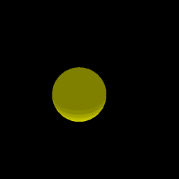
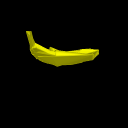
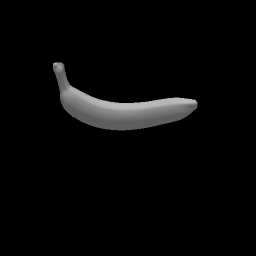
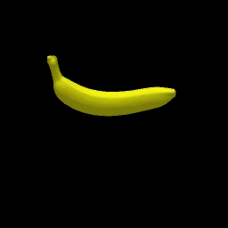

## Soft Rasterizer (softras)

This popular renderer is based on the 2019 ICCV paper by Schichen Liu, Tianye Li, Weikai Chen, and Hao Li. Softras is a differentiable _rasterization-based_ renderer that can provide gradient with respect to the vertex positions and texture (color) of a Mesh. The following examples demonstrate a typical use cases, and can be repurposed to suit your needs.

### Example 1: Simple rendering

The [`softras_simple_render`](softras_simple_render.py) script provides a breezy intro to the renderer API. To run this example, execute the following command

```bash
python softras_simple_render.py
```

This should render a _banana_ from multiple views, and produce a result that looks like this:
<p align="center">
  
</p>

### Example 2: Vertex optimization

The [`softras_vertex_optimization`](softras_vertex_optimization.py) script provides a simple example that demonstrates the usage of gradients with respect to vertex positions. We begin with a sphere mesh, and iteratively deform the mesh until the image formed resembles the banana image rendered in the previous example. Execute

```bash
python softras_vertex_optimization.py
```

This should generate two `gif` files showing the optimization output and the resultant mesh respectively.
<p align="center">
  
</p>
<p align="center">
  
</p>

### Example 3: Texture optimization

The [`softras_texture_optimization`](softras_texture_optimization.py) script provides a simple example that demonstrates the usage of gradients with respect to texture (face colors). We begin with a banana mesh, and want to infer the color of the mesh by looking at the image rendered in the first example. We iteratively update the texture of the mesh until the image formed resembles the banana image rendered in the first example. Execute

```bash
python softras_texture_optimization.py
```

This should generate two `gif` files showing the optimization output and the resultant mesh respectively.
<p align="center">
  
</p>
<p align="center">
  
</p>