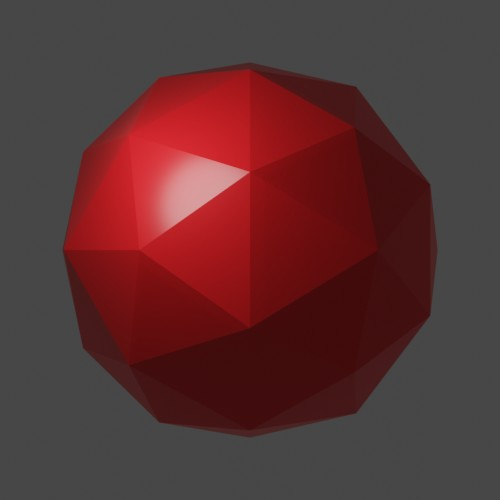
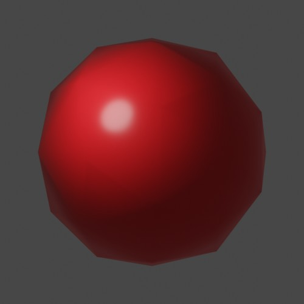
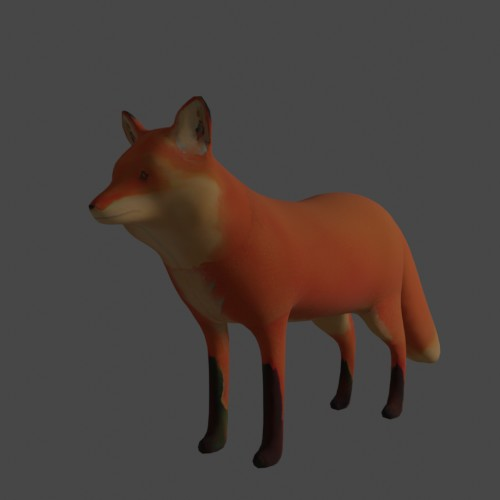
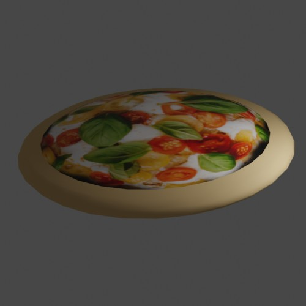
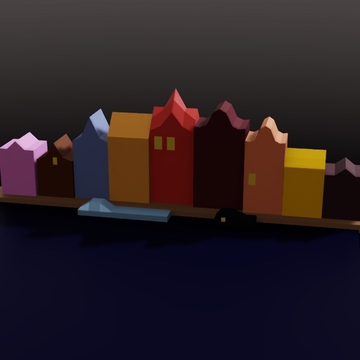

# Sample Meshes

This directory contains sample meshes that might be useful across the project, in both
tests and examples. These are simple test cases for stress-testing and prototyping 
and are not meant to be high-quality 3D examples.

## Flat-shaded Ico Sphere

**Filenames**: [ico_flat.obj](ico_flat.obj), [ico_flat.usda](ico_flat.usda).

**Source**: this mesh is an ico sphere that was authored in Blender with flat shading.

**Formats**: was exported as both `obj` and `usda` (ascii) from Blender.

**Sanity checks**: displays correctly as `obj` and `usda` imported into Blender3.1 and as `usda` imported into [NVIDIA Omniverse](https://www.nvidia.com/en-us/omniverse/). 

**Attributes** of the single mesh in this file:
* Vertices: 42
* Faces: 80 triangles
* Materials: one simple material applied to all faces
* Normals: for flat shading (same normal for all vertices of a face)
* UVs

## Smooth-shaded Ico Sphere

**Filenames**: [ico_smooth.obj](ico_smooth.obj), [ico_smooth.usda](ico_smooth.usda). 

**Source**: this mesh is an ico sphere that was authored in Blender with smooth shading.

**Formats**: was exported as both `obj` and `usda` (ascii) from Blender.

**Sanity checks**: displays correctly as `obj` and `usda` imported into Blender3.1 and as `usda` imported into [NVIDIA Omniverse](https://www.nvidia.com/en-us/omniverse/). 

**Attributes** of the single mesh in this file:
* Vertices: 42
* Faces: 80 triangles
* Materials: one simple material applied to all faces
* Normals: for smooth shading
* UVs

## Textured Fox

**Filenames:** [fox.obj](fox.obj), [fox.usdc](fox.usdc).

**Source:** this file is a simiplified version of TurboSquid ID 1073771, which NVIDIA has licensed with distribution rights. *By using this TurboSquid model, you agree that you will only use the content for research purposes only. You may not redistribute this model.*

**Formats**: the original format is `obj`, which was converted to `usdc` (binary) using Blender exporter.

**Sanity checks**: displays correctly as `obj` and `usdc` imported into Blender3.1 and as `usdc` imported into [NVIDIA Omniverse](https://www.nvidia.com/en-us/omniverse/). 

**Attributes** of the single mesh in this file:
* Vertices: 5002
* Faces: 10000 triangles
* Materials: one simple material with texture applied to all faces
* Normals: for smooth shading
* UVs.

## Multi-Material Pizza

**Filenames:** [pizza.obj](pizza.obj), [pizza.usda](pizza.usda).

**Source:** this file was authored in Blender with pizza texture taken from a [royalty-free photo by Rene Strgar](https://www.pexels.com/photo/italian-style-pizza-13814644/).

**Formats**: was exported as both `obj` and `usda` (ascii) from Blender.

**Sanity checks**: displays correctly as `obj` (not usd) imported into Blender3.1 and as `usda` imported into [NVIDIA Omniverse](https://www.nvidia.com/en-us/omniverse/). 

**Attributes** of the single mesh in this file:
* Vertices: 482
* Faces: 960 triangles
* Materials: one simple material and one texture material applied to groups of faces
* Normals: for smooth shading
* UVs

## Quad Multi-Object Multi-Material Amsterdam

**Filenames:** [amsterdam.obj](amsterdam.obj), [amsterdam.usda](amsterdam.usda).

**Source:** this stylized city was authored in Blender, it contains simple materials and no textures.

**Formats**: was exported as both `obj` and `usda` (ascii) from Blender.

**Sanity checks**: displays correctly as `obj` imported into Blender3.1 and as `usda` imported into [NVIDIA Omniverse](https://www.nvidia.com/en-us/omniverse/). 

**Attributes** of the 18 meshes in this file:
* Vertices: 4, 98, 98, 98, 386, 386, 98, 8, 98, 98, 98, 4, 4, 4, 386, 98, 4, 4
* Faces (all quads): 1, 96, 96, 96, 384, 384, 96, 6, 96, 96, 96, 1, 1, 1, 384, 96, 1, 1
* Materials: 14 simple materials, with all faces of each mesh bound to a single material
* Normals
* UVs

